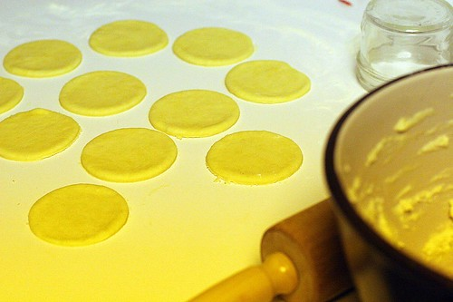
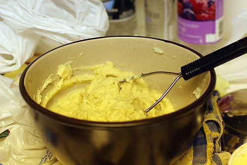

Tonight I had the stupid idea that I would come home from work and make a huge batch of perogies. Normally, I don't attempt anything that dumb -- at least not while sober -- but with a big potlock coming up this weekend, I really need something to bring. Since I know my friends all like my grandma's perogies, I decided to attempt that.

 **Perogies**

So, I realize I'm not my grandma, and there's no possible way I could put as much love and ukranian charm into my perogies as she does hers, but I thought I would take a stab at it. I've done this a few times, but at most I make perogies once a year, and everytime I forget just how much friggin work it is. First thing I had to do was call baba (my grandma) last night and get her to fill in the gaps in my memory. I knew the basics, but I forgot the little bits and pieces.

First problem with making perogies is that I really don't have much food at home. To be honest, I hate grocery shopping. Like really hate it. If I had to choose between not eating for a day or going down to the grocery store, picking out food, standing in long lines, and then making three trips up from my parkade to the 15th floor, I think I'd rather starve. So, on my way home, I stopped at the IGA, hoping to only get a few things. Before I knew it, I had three heavy bags of stuff for the perogy battle, in addition to my laptop bag and my umbrella. I walked another 15 minutes, doing some weird funky shuffle down Howe street, trying to keep everything in balance. When I got to my place, my hands were killing me. This is the part of living downtown I hate.

I'll skip all the stuff I had to do to make these things, but let me sum it up like this -- **I spent nearly four hours slaving over the frickin stove, cutting potatoes, rolling dough, pinching perogies -- and that only amounted to 49 perogies**. So, if you do the math, that's about 4.8 minutes per perogy.

4.8 minutes. Per perogy.

My god, are these things a lot of work. I really don't know how baba does it.

The sad part is 49 perogies isn't really alot, not for a group of people. Heck, I bet I could kill off 25 perogies myself if I was hungry enough, and my friend Brennen could probably do the whole lot himself. I think there are at least 12 people going to be at this dinner. It's a potlock, so I really don't have to bring a ton of perogies, but I definitely need to make at least one more batch. So, I can definitely look forward to giving up yet another night of my life this week making more of these frickin things.

Next time I'm bringing desert.

Update - I checked out Red Square based on one of the comments. Here's a description of their perogies:

> Vareniki come frozen in a 1 lb plastic bag. To serve, simply empty the package into a pot of rapidly boiling water and boil for up to 5 minutes, stirring occasionally until they float to the top; strain and serve with sour cream and fried onions. Vareniki are very low in fat, are cholesterol-free, and provide a delicious and highly nutritious meal. Note that the Vareniki dough is made with no fats or eggs.

They actually sound not bad. The only difference is that baba's dough is made from vegetable fat **and** eggs, which is why it probably taste so damn good.
