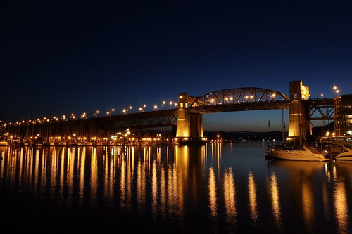

First off -- I hate my tripod.. I'm going to get a new one, just because it's nearly impossible to figure out if mine is level. Anyways, I'm one of those somewhat stubborn people in life. I can be reasoned with, but if I'm in the wrong mood, it's hard to change my mind about some things.. I'd rather do some weird acrobatic maneuver with a pool cue than admit defeat and use the granny. So when it comes to photography, I can probably count the number of times I've used a tripod in my life on one hand. That being said, I read once that the difference between a good photo and a great photo is a tripod. So, I thought it might be fun to go for a quick walk tonight and take some shots around my place. I didn't have that much time, but I managed to snap a few that I liked.

