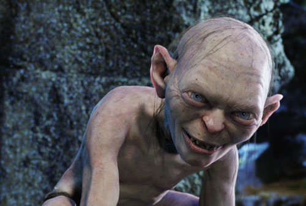

You thought this day would never come, didn't you Air Canada? All your posturing, your laughing. You may not remember us, but we sure remember you. Oh yes, [we haven't forgotten the night we had together](http://www.migratorynerd.com/2006/09/15/vancouvers-toast/), have we precious?

We remember landing in Toronto, coming back from a brief trip to Boston, so anxious to finally get into our own bed in Vancouver and fall asleep later that night. And dream. Yes, we dreamed once. Of fields and sunshine. But it took that from us. Yes, took it from us they did, my precious.

Upon arriving in Toronto, one of its minions came forth, only to announce that our flight home, the last flight of the evening back to the ocean and the mountains was in fact, "toast" as he most eloquently put it. Toasts precious, nasty toasts. We spent that night huddled in the Toronto Airport, trying to find a hotel that would take us. We asked it to give us some kind of compensation, but its toothless minion merely mocked us, laughing at our misfortune. So, we cabbed out of the airport and found a small piece of shit hotel and set up camp for a few hours, on our own expense, and waited in the darkness for another flight to take us home.

And in the time since, we have spent many a night huddled over a computer, scheming, plotting, waiting for our chance to get it back. How it has haunted our dreams, that evil airline. And now, after all this time, we believe we will finally have our chance.

A few minutes ago, we cashed in our aeroplan miles (oh the irony) and booked a flight to Ottawa, on its expense -- in business class no less. And we can tell you it still doesn't fully comprehend the depths of its stupidity, does it precious? But rest assured, in August, as we walk through the doors of the Maple Leaf Lounge in Vancouver, and take seat in front of its free booze, it will know the full extent of its folly. For we will make it pay for that night with every ounce of our liver that we can muster. And we won'ts stop there, will we precious?

"More champagne sir?" Oh yes, we'd love some, wouldn't we precious?
