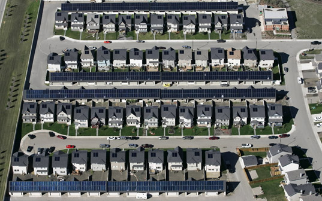

Today I read [an article about a unique solar powered community in Canada](http://digg.com/environment/A_Unique_Solar_Powered_Community_in_Canada). The actual location of this community is Okotoks, Alberta.

The residents there have created a solar array for their houses that manages to completely power 52 homes.

> The 52-home solar community has installed an array of solar panels on the roofs of their houses and garages. Glycol solution runs through an insulated piping system, or collector loop, that connects the array of solar panels. The solar panels absorb the solar energy during the daytime and heat the glycol solution. The glycol solution travels through the collector loop and reaches an underground heat exchanger within the community’s centralized Energy Center. The heat is then transferred from heat exchanger to the water stored in a short-term storage tank. The glycol solution returns to the solar collector system. The Energy Center has short-term thermal storage tanks and long-thermal storage tanks (Borehole Thermal Energy Storage (BTES) system).

Seeing efforts like this is extremely encouraging. Given that solar power is dropping in price every year, and that the technological achievements in alternative energy are increasing rapidly, I foresee a time in the near future when switching to clean alternative energy will not only be environmentally sound, but also financially rewarding as well.

This entry was written for [Blogathon 2008](http://www.migratorynerd.com/tag/blogathon), and in support of the [Union Gospel Mission](http://ugm.ca) charity. If you'd like to donate to the cause, please visit [the blogathon donation page](http://miss604.com/blogathon) and fill out the form near the middle. You can also [follow the blogathon RSS feed for this site by clicking here](http://www.migratorynerd.com/tag/blogathon/feed).
