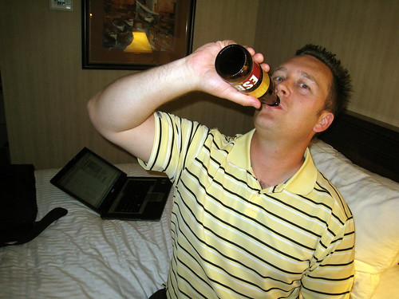

So, it's 30 minutes past midnight, and we just got back from another long day at Google. I'm sitting in Scott's 82 degree fahrenheit hotel room with Derek and twelve beers. Last night we realized that a 14 hour day would be a lot better if we had a few beers to finish it off, so we basically started the midnight-gas-station-beer-run tradition.

For those of you who don't really know what Silicon Valley is like, I'll give you a little heads up. Most of Silicon Valley is centered around a city south of San Francisco called San Jose (affectionately called "Man Jose" by the locals, since it's predominantly populated by guys). Unfortunately, there's not really much to do in the high-tech areas except for work, or drink gas station beer. We've done fairly well on both of those activities so far.

I spent most of today messing around with the protocol messages that ultimately set up and tear down the entire peer to peer network, as well as establish point to point connections between peers. The messages actually have to be digitally signed using cryptographic certificates, which makes it somewhat tricky. By tomorrow I should have the entire messaging system implemented, which is a pretty decent run after three days.

This is my first hardcore coding session, and it's been actually a lot of fun for me. Most of the people down here are the experts in their industry. Sitting around telling jokes and discussing hard problems with some of the thought leaders in the IETF is obviously a lot of fun, and I hope I get a chance to do a few more of these in the future.

Anyways, one more long day here, and then I'm officially on vacation. I think we're going to wrap things up a bit earlier tomorrow and all go out and have a nice dinner. On Thursday, I'll be heading to Los Angeles, and will hopefully leave my jeans behind for the rest of the summer.

\*\* Update - we ended up plowing through the first twelve in fairly short order, so we walked down to the Gas Station and got a few more.
