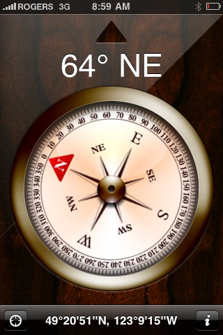

When Apple introduced the iPhone 3GS, they added a new piece of hardware: a magnetometer. That little do-dad can pick up magnetic field lines, and basically act as a virtual compass.

While kind of a neat feature, I don't think it's very practical. I mean, pretty much every iPhone 3G user I know has the data plan, which basically means they can access Google Maps whenever they want. Yes, you can't get a real time indication of your direction using Google maps, but if you move around you can obviously watch what happens and see which direction you are facing. But to be honest, it's pretty rare I ever give or receive directions of the sort "you go down that street, and then turn due east." Most directions are made in relation to landmarks or streets, both of which are direction independent.

The feature I really would love to see is a built in thermometer. Quite often I've asked myself just how warm it is, either while sitting on a patio, or in my apartment. I also spent a few summers doing weather modeling with Environment Canada and out at UBC, and one of the problems with weather forecasts is that the initial conditions used to initialize the nightly predictive models utilize sparse data. Imagine if every iPhone user could opt-in to submitting their weather data from their phone to a central database, and having that data become available to the public? I imagine the accuracy of the weather models would increase substantially. It would also be pretty darn cool.
