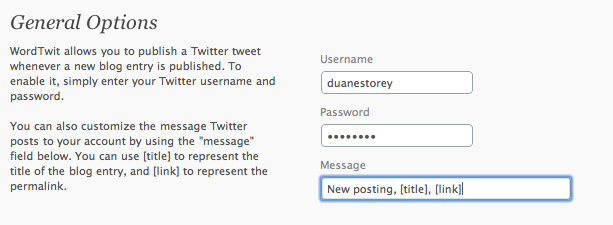

A lot of my fellow bloggers around here have installed WordTwit today so that they can have their WordPress posts automatically show up on their Twitter feeds. While WordTwit doesn't officially support hashtags yet (those crazy things that look like #someword on Twitter), there's a quick little work around for events such as Blogathon.

First, navigate to the WordTwit administration panel. Typically you'll see something like this under general options:

The trick is to edit that text such that the hashtag you'd like to be added is automatically inserted after each post. So for the case of Blogathon, you can simply add a "#blogathon" to the end. It should look like this when it's all done:

Just remember to remove the hashtag when your event is over. Hashtags will be officially supported on a per-entry basis in the future, but for now this is a decent enough work-around for events.
