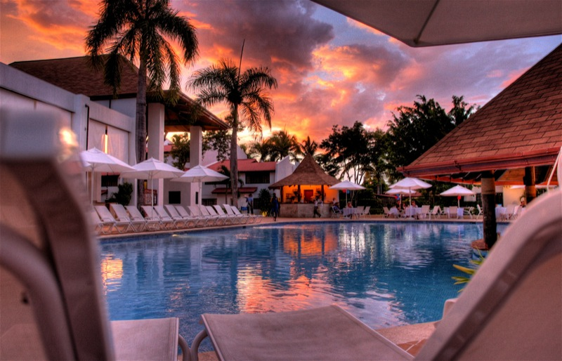

In a little over 24 hours, I'll be heading into Vancouver with my friend Tony, ultimately ending up at Vancouver International for a flight to Punta Cana in the Dominican Republic. This will not only be the first vacation that's ever been longer than one week, but it'll also be the first time really since March where I'll have had a full week to basically kick my feet up and relax. While the last few weeks have been a bit light in terms of work, Dale and I have been going pretty much non-stop all of this last year, even working part of Christmas at the start of the year. That's why this year we're purposefully keeping December fairly light, so we can both enjoy the holidays with some of our friends and family.

I'll arrive in Punta Cana in the early afternoon on Thursday, and both Dale and Sara will arrive the day after. My friends [John](http://www.johnbollwitt.com) and [Rebecca](http://www.miss604.com) will also be down there the following week, so hopefully we'll be able to meet up with them for drinks at least one night.

I just got back from buying a new suitcase, and starting the laundry cycle that will ultimately see me with close to two weeks worth of clothes in my suitcase. I need to sneak out at some point and buy some new sunglasses, but hopefully everything else will come together smoothly tonight.

There's a [Tweetup in Vancouver tomorrow](http://vancouvertweetup.ning.com/events/dip-your-upper-lip-the) night, so I'm hoping to swing by that with my friend Tony (who is giving me a ride). It'll be nice to have a few pre-flight drinks with some old friends, and then head down to the airport for my journey across the continent. I'm totally excited, and can't wait to feel the warm blast of air when the airplane doors open on the tarmac in Punta Cana.

I'll try and give an update every few days, but other than that I'll purposefully be laying low during the trip. When I get back, the Christmas tree will be going up, and I'll put myself into Christmas mode. Next update will be from the Caribbean.
