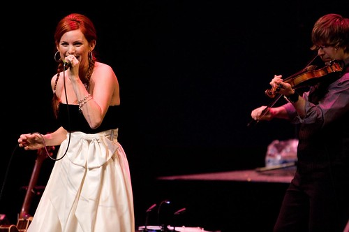
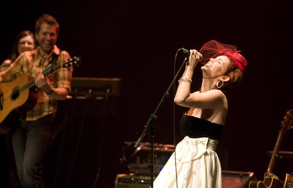
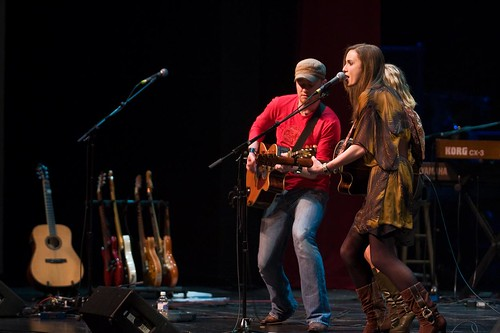
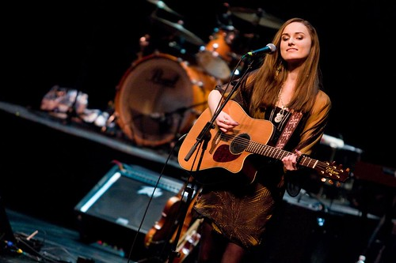

Normally when I photograph and event I have a blog entry up prior to heading down and actually taking photos. Unfortunately I didn't get around do doing an entry before Friday's night's event, so I thought I'd do one now.

I went down to Surrey the other day to photograph the 'Jessie Farrell and Friends' concert for [JRFM](http://www.jrfm.com/). Also playing during the show were Jaydee Bixby, The Higgins, and Chad Brownlee. The event was in support of JRFM's [Basics for Babies!](http://www.jrfm.com/pages/4710/), which is why I offered to help out and snap some photos in support of the cause.

Truthfully, it's been quite some time since I've photographed anything, let alone a music concert. I've photographed many concerts before, including the BC Festival 150 concert in Victoria, and the 2008 Canadian Juno Awards in Calgary, but nothing locally since last summer probably. So I was definitely looking forward to brushing the dust off of my gear and taking some photos.

I've seen Jessie play a few times now, once at the BC Festival 150 I believe, and another time at the Red Room during New Music West. I also worked with Dale on Jessie's original version of her website. Strangely enough I still haven't met Jessie yet, but hopefully will manage to next time I catch one of her shows.

The show was really great, and I had just as much fun watching it as I did taking photos. Since Lady Gaga was playing in Vancouver the same night, Jessie paid a little homage to the event by wearing a little red hat/mask for a song during the show (shown above). In addition to Jessie's set, I also thoroughly enjoyed listening to The Higgins play, and was surprised I hadn't heard of them before. I'm definitely going to make an attempt to go hear them again sometime in the near future if I can swing it.

At the end of the night all the performers came out on stage and sung a few Christmas carols, which was a nice touch. All in all, a really awesome event, and I'm glad I got to participate in a small capacity by taking some photos. Make sure you check out the [Basics for Babies](http://www.jrfm.com/pages/4710/) page and find out more.

Also, you can find out more about Jessie Farrell by visiting her [main website](http://www.jessiefarrell.com), or by [following her on Twitter](http://twitter.com/jessiefarrell). Same goes for [The Higgins](http://www.higginsmusic.com/), who are also [on Twitter](http://twitter.com/thehigginsmusic).
