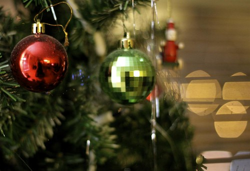

It's not officially Christmas yet where I am, but it's only about six hours away on the east coast of Canada, so that's close enough.

As most people know, I moved back to my home town back in January to be closer to some of my old friends and of course my family. The last time I lived in Chilliwack in any capacity was when I was 18 years old, right before heading off for the city and university. So, this is my first Christmas as a resident of Chilliwack in about 14 years. Pretty wild now that I think about it.

Thankfully we don't really buy many gifts these days (since I'm pretty crappy at buying gifts), but I had a bit of shopping to do today and I managed to get most of it done. My niece (who is now approaching 12 years old) is now apparently into girly things like nail polish and earrings, so Uncle Duane went out and got her a pre-paid mini-manicure at one of the nicest spas in Chilliwack. My nephew Derek has recently started playing the guitar, and since his guitar is almost always out of tune when I stop by, he's getting a fancy little digital tuner for his guitar. Hopefully they'll like it.

Tonight is a little dinner at my sister's house with my mom's side of the family (which coincidentally all happens to be Ukrainian). That ultimately means tonight will be full of perogies, laughter, and a few beers between some of us guys. I went out today and stocked up on a few groceries, and also enough beer to last me through the Christmas beer drought (which lasts until the stores open again, probably in a few days). Tomorrow I'll head over to my sister's in the morning to watch the kids open presents, and afterwards probably down to my dad's house for a visit. On boxing day is a big dinner down at some clubhouse that will involve, for the first time, both sides of my family together, which should be a lot of fun.

So, on behalf of me and my family, I wanted to wish everyone who reads this site a very Merry Christmas and Happy Holidays. I've had this site now for over ten years now -- I want to thank everyone for the support of this site, and more importantly, the support everyone has shown me through the years, especially during the last few years when I was pretty down. Thanks everyone -- have a great Christmas.
