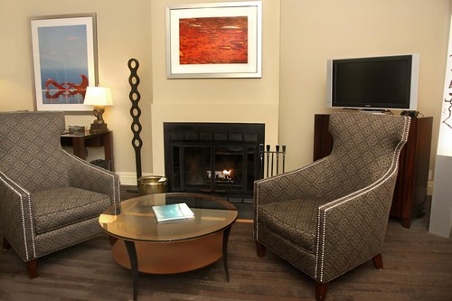

I'm heading to a friend's wedding in Seattle in November. I'm actually pretty excited about the trip because it'll be my first real weekend there since 2007. Seattle's one of those cities I always expected to fall in love with, but for whatever reason, just haven't managed to yet. I suspect it's because I don't really know where to go when I'm in the city, but I'll do a bit more research this time around. The last time I was there I stayed at the relatively trendy [Hotel Max](http://www.hotelmaxseattle.com/), which was fairly central and had a decent little lounge.

I was talking to the people at the [Alexis Hotel](http://www.alexishotel.com/) in Seattle about my upcoming trip (which is a [Kimpton](http://www.kimptonhotels.com/) hotel), and they were more than happy to offer me an amazing deal for their Fireplace Suite for the weekend. I can't say that I've ever stayed in a 750 sq. foot hotel room that has a built in wood burning fireplace, but I'm definitely looking forward to it.

The Alexis Hotel is also [offering a great deal for Canadians looking to get out of the city during the 2010 Olympics](http://www.alexishotel.com/alxspec/index.html). For anyone interested, they are offering 20.10% off of their regular prices during that time. So if you're looking to escape, Seattle might be a great destination for you.

With any luck, I'll also be heading to the Caribbean in late November for two weeks. Not sure on the final destination yet, but Punta Cana is looking fairly likely.
