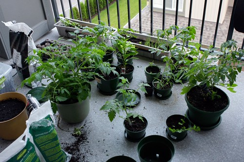

Yes, that's all I've become. I wake up, I go outside, my plants get mad at me, and I spend the morning watering them and looking after them.

For those who are just joining the saga, I planted a few tomato plants on my patio at the end of May. I've watched them grow, seen them fall down a few times, nursed them back to health, and in return, I've been rewarded by the growth of a pile of little tiny tomatoes.

One of the challenges with growing fruits and vegetables on your patio is that it's really hard to get them enough water, especially in this kind of heat. With a normal garden, you can soak the soil thoroughly such that the plants basically have a moisture reservoir. For a plant in a 12" pot though, there's really not too much you can do, other than water them twice a day or so, which is what I'm doing.

I'll try and post a few new photos later of my garden. The green peppers are about a week from being done, and my hot peppers are just changing colour now. I figure the Roma tomatoes are probably a month or so away, but the cherry tomatoes might be a bit sooner.
