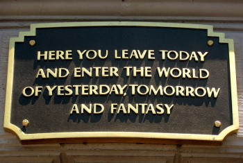

\[caption id="attachment\_1961" align="alignright" width="350" caption="Disneyland"\]\[/caption\]

I've basically been on-the-go non-stop since San Francisco, so I haven't had much time to do anything on the computer. I originally had a 11am flight out of San Francisco, but for whatever reason it was delayed nearly four hours, and I didn't arrive until close to 4pm. It probably would have been faster to drive.

[Tony](http://tonypierce.com) took me out for a great night down in Los Angeles. We went on a full tour of Hollywood, then picked up a few tall-boys and just chilled for a while. I also had some really great mexican food at a local hole-in-the-wall that Tony frequents from time to time.

I only had one night in Los Angeles, otherwise I would have liked to hang out longer and hit a pub with Tony. But regardless, it was cool catching up with Tony again and seeing some of the local scenery.

I spent yesterday down here at Disneyland. It's crazy hot in Anaheim -- it was 35C yesterday, and is supposed to be 36-37C today. I'm not complaining -- it's a nice change from the doom and gloom up in Vancouver.

   

Not much has changed in the 20 or so years it's been since I've been to Disneyland. Yesterday I went on the Matterhorn, Pirates of the Caribbean, Big Thunder Mountain Railroad, and a few other small rides. Today we're heading over to the California Adventure, where apparently a few new rides have opened recently.
