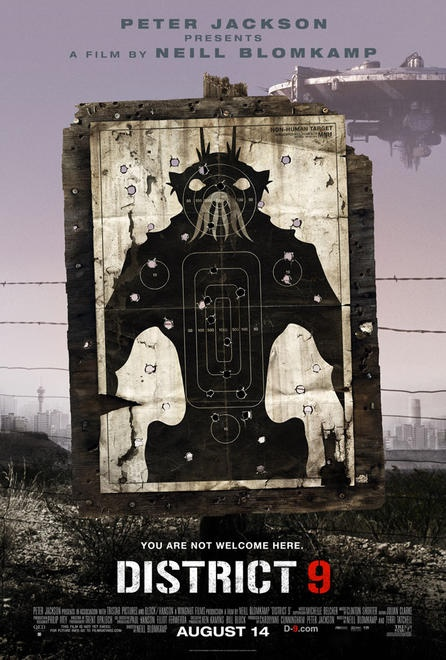

I rented a pile of movies on the weekend, mostly older flicks I had already seen before. That being said, I went over to my brother-in-law's house on Friday and watched District 9 and Bruno.

District 9 was completely unexpected, and I'm not even sure what I thought of it to be honest. Overall I enjoyed it, and it was the first movie to surprise me in a long time, probably since From Dusk til Dawn. Without a doubt, you can see Peter Jackson's hand in the movie, especially with the parallels to his own mockumentary, [Forgotten Silver](http://en.wikipedia.org/wiki/Forgotten_Silver) (that caused a lot of controversy when it came out), and some of his earlier splatter films. I'd probably have to watch District 9 again to get a hardened opinion on the movie, but in first pass it was pretty cool.

Bruno on the other hand, while it had a few funny parts, wasn't so great. I guess the problem with Bruno for me is that every scene is presented like it happened spontaneously, but given the camera location (especially in scenes where a camera shouldn't really be there), it's obvious many of the "spontaneous" scenes were staged. Knowing that takes a lot of the shock or humour out of each scene. In general, I think Borat was a far funnier film.

I also watched a few older movies, including Stargate and Apocolypto (which I'd seen before, but wanted to watch again). Lately I've been doing a bit of coding in front of the TV, and older movies are pretty ideal for that since I can let my attention wander to the screen from time to time without missing too much.
