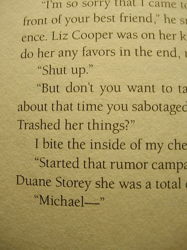

Courtney Summers is an author of young adult books and also a client of BraveNewCode's; we've been really fortunate to work with her a few times and help her out with a few iterations of her website.

A few months ago I was joking on Twitter with Courtney that it would be cool if she found a way to put me in her next book. Well, Courtney got the final version of her book to proof last night, and sure enough, she managed to sneak me in.

As you can see, there's a character in her new book, [Some Girls Are](http://courtneysummers.ca/novels/some-girls-are/), named Duane Storey. I can finally scratch "being a character in a young adult book targeted at young teenage girls" off of my bucket list!

So thanks Courtney! It's really cool. Head on over to Courtney's site [to find out more about her new book](http://courtneysummers.ca/novels/some-girls-are/)
