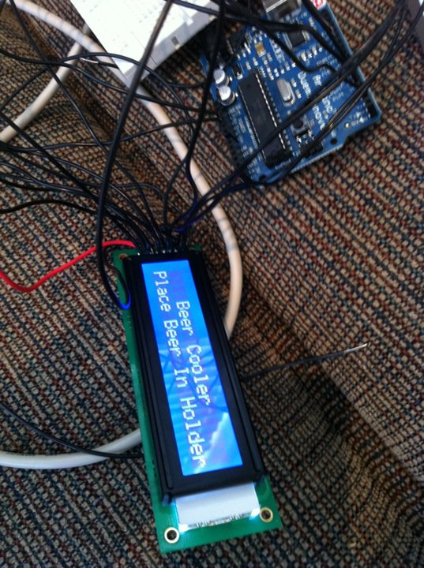

Almost ten years ago, I started playing around with some microprocessor hobby kits at home. At the time they main ones were called STAMPS and you programmed them with BASIC. You could make them run motors, measure temperature, pretty much whatever you wanted them to do.

A few weeks ago I ran into my friend John, and he was telling me about a similar thing called the [Arduino](http://www.arduino.cc/). It's basically a small little microprocessor kit that has basic inputs and outputs that you can use to do arbitrary things. Given that I'm an electrical engineer by education and that I haven't really done anything electrical in years, I thought it would be fun to try and build something small over the winter.

So, I came up with a random idea involving an automated beer cooler. The idea would be to have a device that could cool a beer in a very short amount of time. I've been doing some hand calculations to figure out just what I can get away with, but I won't know for sure until I put it all together. But I'm hoping it'll be on the order of 1.5 to 3 minutes to go from a warm beer to one that's nearly perfect temperature.

The technology I'm going to use will involve Peltier coolers. These are semiconductor devices that essentially act like a heat pump -- the remove heat from one side and transfer it to the other side. The main use for these nowadays is to cool CPU chips off on overclocked machines, but there's no reason it can't be adapted to cool beer in a hurry.

So today after work I set about soldering the LCD so that I could hook it up to the Arduino. I then wrote a quick program to transfer to the unit to fire up the LCD, and presto:

There's still a lot to do, and I have to do a napkin schematic to figure out how it's going to work. Unlike the microcontroller, the actual Peltier coolers take a lot of juice to run properly, so I need to create a secondary power supply to run them. I picked up a simple relay to do the switching of the current, which of course the microcontroller will operate. I also need to close the loop, which means monitoring the temperature of the beer using a few thermistors. But, hopefully sometime this winter I'll be able to test out my first beer, cooling from room temperature down to around 8C or so.
