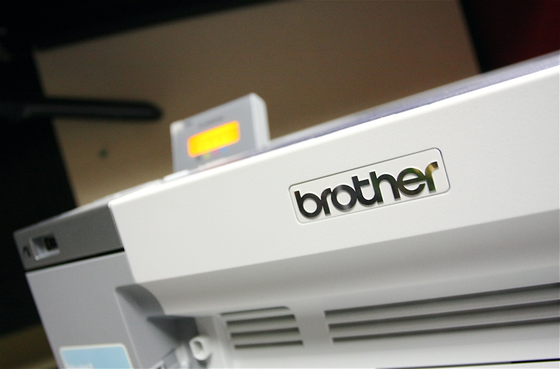

A few months ago, Darren Barefoot put up a proposal on his blog asking for west-coast bloggers to review a few Brother printers. Since I love getting my hands on new technology, and have never really used a color laser printer before, I signed up for the challenge.

\[caption id="attachment\_11109" align="aligncenter" width="800"\] Brother Printer for Review\[/caption\]

A few weeks later the Brother HL-4050 CDN Printer arrived at my office place. First of all, let me just say that nothing could have prepared me for not only how big the box was, but also how insanely heavy it was. I seriously had a hard time moving it from the front door over to the spare desk next to me.

That's what it looks like when it's all unpacked. As you can see, it takes up a huge amount of desk space (this is offset by the fact that it looks pretty cool). There are a few different ways to hook it up to a computer, but I chose the network cable approach since I wanted to use it from my machine on the other side of the room. It only took me about five minutes to figure out the menu system, and in that time I managed to configure the printer to use DHCP and also determine it's IP address. Good to go.

Unfortunately, the next part of the process turned out to be a major roadblock. I attempted to connect to the printer from my MacBook Pro laptop. While I managed to set it up just fine, I struggled for about an hour to get the printer to print anything at all. Finally I resorted to hitting some support forums on the web, and eventually came to the conclusion that the Brother HL-4050 CDN doesn't work out of the box with OS-X Leopard. Some of the forums suggested there were updated drivers buried on the Leopard installation DVD somewhere, but I never found them.

Instead of giving up on this review, I decided to brush the dust of my Windows XP machine at work and do the review from there. Setting the printer up in Windows was a bit more challenging than on the Mac. If I would have been smart, I would have just downloaded the Brother printer drivers from their website and done the installation first. Had I done that, the installation would have gone rather quickly. Instead, I tried to use the "Add Or Remove Printers" wizard with XP, and unfortunately that was just a dead end. Even when I got it to connect to the printer using its IP address, it still couldn't load the correct driver. The Brother installation package fixed everything though, so I suggest people start with that.

Once the software was configured, I went through the rest of the packaging instructions to get the printer ready to roll. The first step was to remove a few pieces of plastic on the inside that secure everything during shipping of the unit. Next, you have to manually insert the color toner cartridges into the appropriate slots. They are all color coded, so it's fairly simple to accomplish. Once they were all in, I closed it up and decided to do some tests.

I guess I should also point out that I used semi-glossy brochure paper from HP for most of the tests. I tried to get my hands on real photo-paper, but I couldn't find any around the office. Since I was primarily interested in printing photographs that would ultimately go up on walls, I wanted something with a bit of a gloss to it. I slid open the bottom paper drawer and put a stack of about 50 in.

I went through my Flickr sets and printed a pile of some of my favourite HDR shots, which are typically the ones I'd print and send to people. I did variations on a few of the settings available via the Brother printer driver (an obvious change is to go from the default of 600 DPI to 2400 DPI). My first impressions were fairly good, although there seemed to be an obvious dulling of the saturation on the printer compared the originals. It's fairly likely the gamut of the printer is far less than the monitor, so perhaps it's to be expected. I'm not sure if I could counter that in software though, or if it is something you just have to accept.

After about 50 of these, I think I have a fairly good idea of how the printer performed. One thing I noticed was that on most of the photos there were slight indentations where the rollers gripped the paper. I'm not sure if these marks would eventually go away, but since the paper was glossy the slight impressions reflected light differently and definitely detracted from the photo. I'm being a bit picky, since I think the quality was fairly good, but I don't think I would hang one on the wall.

Perhaps better photo paper or backloading the printer would make those marks less visible. I'm not sure. For everyday photos or things you want to put in a scrapbook, I think the quality is more than acceptable. But for the area I was shooting for, that is having the ability to print out high-quality images that I conceivably send to people to use as art, I think it falls a bit short.

So in summary, I had troubles with the printer out of the box on a Mac. On Windows, installation of the Brother printer drivers should really come before anything else. Image quality was good, although I found they were slightly desaturated. The image quality for printed photos is definitely enough for scrap books or casual printing for friends, but I think it's still a bit wanting in the area of photographic reproduction for use as art or wall decorations.

Big thanks to [Darren Barefoot](http://darrenbarefoot.com/) and [Capulet](http://www.capulet.com/) for setting this up, as well as [Brother](http://brother.com) for the use of the printer.

### 2013 Update

I used the Brother HL-4050 CDN for a quite a while and it performed quite well. It's no longer in production, but the [Brother HL-4150 CDN Printer](http://amzn.to/12BMJQv) is a close replacement.
