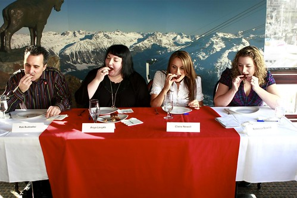
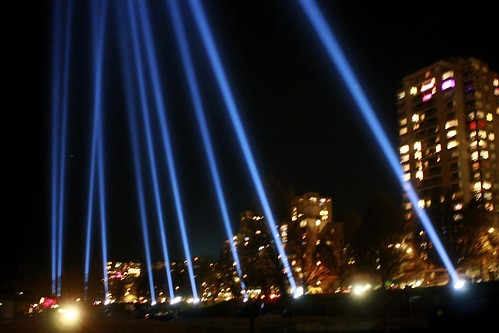

We started the day yesterday down on Granville Island, eating a nice healthy breakfast of cheese fondue at the Swiss House. Rebecca was there to judge a chocolate contest, and we tagged along for the event. The Swiss House is in Bridges on Granville Island, which is a really picturesque location. The prices were a little steep for the food, but I guess you're paying a bit for the novelty of eating Swiss Food and having a great view of False Creek.

Afterwards we decided to head on over to the Atlantic House, which is currently in the Backstage Lounge on Granville Island. We waited close to 90 minutes to get inside, which made the beer taste that much better when we did finally make it inside. Lots of people came and went during the event, which made for a really fun day. Other than their daily tastings of food, there isn't anything else to eat at the Atlantic House, so make sure you're not super hungry if you go.

Afterwards I headed back to John and Rebecca's house to grab my suitcase and eventually made it to the North Shore to visit Dave. On the way back to Rebecca's we walked past the awesome lights alongside of False Creek.

It's been a pretty unreal experience so far, and it's been great being in the city while some of this is going on. I'm at Waves Coffee near Gastown right now -- there are so many athletes and visitors in the coffee shop now that hardly anyone is speaking english, which is pretty cool.
