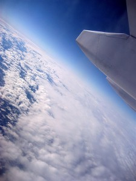

\[caption id="attachment\_693" align="alignright" width="225" caption="The Adventure Starts Soon!"\]\[/caption\]

Things are moving quickly now. My apartment is about 90% packed at this point, and I'm currently cleaning like a mad man so that I can get most of my damage deposit back. I've already moved in with my parents for the month of December, after which I'll be heading to Vancouver Airport and catching a plane to Buenos Aires.

Everyone keeps asking me if I'm excited. Truthfully, not yet. I know I will be, but packing and moving are both a bit stressful, and I haven't had too much time to fantasize about my first beer in Argentina yet. I'm hoping once December rolls around and I no longer have the keys to my apartment that the realization that I'm about to spend a year traveling will finally hit me.

I'm going to start keeping a running tally of my traveling expenses on this site so that others can see how much everything costs. So far excluding flights I'm probably up to a few hundred dollars in travel related expenses, and I'm sure I'll spend a bit more before I leave.

I was originally only going to take a backpack to Buenos Aires, but considering I'm going for three months I think I'm going to also bring a suitcase. When the time comes to leave Buenos Aires, I'll probably just mail my clothes back home and sell the suitcase locally to someone else. But the reality is that I won't really be backpacking it in Argentina, at least not until the very end of my trip, so I might as well bring a few more items. In particular, I was on a health kick out here until the start of November, after which point I started to get busy. So I'd like to bring some running shoes and maybe find a local gym in Argentina to go to.

So, only five more weeks until the adventure begins.
