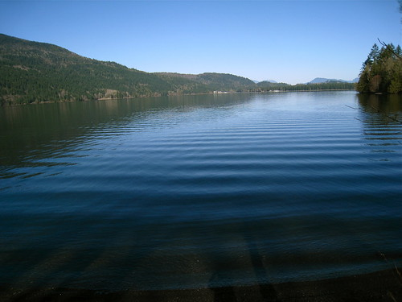
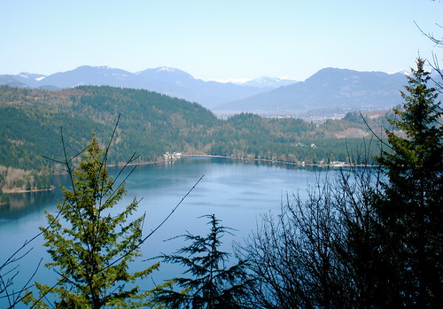

I woke up yesterday to another sunny day here in CowTown™. I was debating going to the gym, but decided instead to go and try a local hike. So I pulled my hiking boots out of a box, found some clean socks, and drove up to the trailhead for Teapot Hill, which is only about 10 minutes from my house.

Teapot hill isn't that hard of a hike, but considering I haven't been hiking really in years, it did a good job of wearing me out. The elevation gain is only around 300 meters, but a lot of that comes near the end. At the top of the hike is a pretty nice view of Cultus Lake, so I snapped a few photos and rested there.

I used to actually be quite the hiker. About 5 years ago I would meet up with some friends on the North Shore and do a hike a few times a month. It was a lot of fun, and it felt pretty awesome being outside and getting some exercise. I'm still quite a ways away from being in good enough shape to tackle some of the hikes I used to do, but I'm hoping to slowly work my way back up to that level. I hurt my knee fairly badly on the West Coast Trail a few years, so I'm hoping that that injury doesn't affect by ability to hike in the long term, but only time will tell.

With the current weather being as nice as it is, I've started thinking about camping again. Last summer I didn't really get out as many times as I had liked, so I'm hoping to make up for that this year. Because I didn't have reservations to any spots last year, I pretty much never got into any campgrounds on the weekends that I wanted. So this year I'm going to actually reserve a pile of weekends at a few local campgrounds and hope for the best. In the event that I can't make it on a particular weekend, I'll probably just toss a Tweet up and see if anyone wants to use my spots.

Lastly, I've been giving this site quite a bit of thought recently and have decided to spend a bit less time blogging and tweeting. With summer coming I'm hoping to spend as much time as possible outside, which naturally means I'll be on the computer a bit less and hopefully out whacking tennis balls around instead. So in the event that you swing by here and don't see an update for a few weeks, it's nothing to worry about -- I'm probably just working on my culinary skills or out on a hike.

I'm packing for a quick trip to Hamilton right now to meet up with Dale and do a bit of work. I leave tomorrow morning and get into Hamilton in the early evening. I should be back next week sometime.
