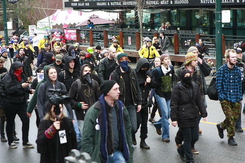

This morning John Bollwitt and I were sitting on his couch watching TV and saw that there were a group of protesters heading towards Robson Street. Both him and I immediately grabbed our cameras and headed outside to see if we could see what was going on, and possibly grab a few photos.

The group involved was waving a green and black flag with a big "A" in the center, which apparently stands for anarchy. Several of the protesters were wearing masks, and the police were following behind closely, but not engaging any of the protesters.

At one point both John and I saw a group of protesters knock a pile of mailboxes and newspaper bins over and keep walking. There was a group of non-protesters following behind trying to fix some of the damage these people were doing along the way. At one point I saw a mother pushing a baby stroller stop and kick down a green newspaper bin, which was a rather sad spectacle.

I'm in the process of uploading a pile of photos, including one of the individual who pushed that newspaper box down, so check back in a bit for an updated post.

