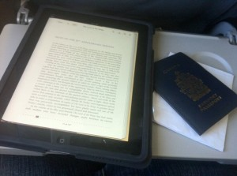

Getting down to the wire!

Yesterday I was talking about my trip to some family members, and came to the realization that I'm only a week away from starting it. Truthfully, it's starting to sink in now, and I find myself split between feeling excited and feeling a bit nervous. Excited, because I have a great opportunity to see some of the world and make some new friends along the way. Nervous, because I hate flying and challenging traveling situations. But, I'm approaching this whole trip with an open mind, so I'll just roll with whatever punches come my way.

I've said most of my goodbyes to friends already, and will wait until next weekend to say them to family members. I don't really like goodbyes, so I'll just roll with "see you guys soon". In all likelihood I'll be gone for a full year, but if a cheap flight comes up next summer, I may bounce back home for a week and do a bit of visiting, but we'll see.

In terms of things left to prepare for, here's what's left, in rough order of when I'll have to do them:

- Do a final clean of my car prior to storage
- Forward my mail for a few last minute items
- Write a few letters to cancel the remaining items (house insurance, etc).
- Final loads of laundry and packing
- Say a few "see you soons" around here
- Pack one suitcase and one carry-on bag
- Book my transportation from the airport in Buenos Aires to downtown
- Last trip to the storage locker
- Pick up some cash from the bank
- Park my car and finish getting it ready for storage (fuel stabilizer, remove battery, etc).
- Head to Vancouver and check-in to a hotel for a few days
- Board a plane for South America

So, not very much left to do at all. South America, here I come!
