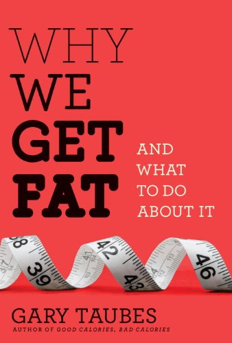

Without a doubt, probably the best book I've read on food, nutrition, and the ongoing obesity epidemic raging through the world is a book called _[Good Calories, Bad Calories](http://www.amazon.com/gp/product/1400033462?ie=UTF8&tag=duanstor-20&linkCode=as2&camp=1789&creative=9325&creativeASIN=1400033462)_ by [Gary Taubes](http://en.wikipedia.org/wiki/Gary_Taubes). Gary Taubes is a New York Times best selling author, and has been featured on quite a few TV programs, including Larry King Live. I've probably read Good Calories, Bad Calories in its entirety around four or five times now, each time managing to soak up a little more of the content.

Shortly after returning from Cancun last year, I went searching for Gary Taube's website, only to find that he didn't have one. I decided at that point to track Gary down and see if I could offer any help getting an online presence together. I managed to find a website that did an interview with Gary last year, and asked the author to forward my email on to Gary. A few days later I found myself on the phone with Gary in New York talking about the web.

Gary has written a new book, and it's scheduled to be released in just a few short months. Already blogs are starting to talk about it, and I personally expect it to be pre-ordered on a massive scale before it is released.

The title of the book is _[Why We Get Fat](http://www.amazon.com/gp/product/0307272702?ie=UTF8&tag=duanstor-20&linkCode=as2&camp=1789&creative=9325&creativeASIN=0307272702)_ and the release date is December 28th, 2010.

In various interviews, Gary has indicated the the book is less than half the size as Good Calories, Bad Calories, and should appeal to a wider audience. While the content is in line with that presented in Good Calories, Bad Calories, it also has been expanded using some of Gary's lectures on obesity and adiposity he has given at various universities over the last few years.

I received an email from Gary this morning letting me know that he had placed me in the book's thanks section for some of the help I gave him over the last year. It's a really nice gesture, and I'm looking forward to reading Gary's book when it comes out. At that point in time I'll probably be a few days away from my flight to Argentina, so perhaps I'll save the book for the plane ride down.

If you're interested in pre-ordering it, head on over to Amazon and check out [Why We Get Fat: And What to Do About It](http://www.amazon.com/gp/product/0307272702?ie=UTF8&tag=duanstor-20&linkCode=as2&camp=1789&creative=9325&creativeASIN=0307272702). It's also available for pre-order on the [Kindle](http://www.amazon.com/gp/product/B003WUYOQ6?ie=UTF8&tag=duanstor-20&linkCode=as2&camp=1789&creative=9325&creativeASIN=B003WUYOQ6) if that's your thing.
