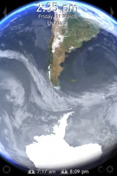

Yes sports fans, it's time for another update. Today is day 65 in Buenos Aires. About an hour ago I had my last hair-cut in the city, and going forward there are a bunch of "lasts" about to happen. In fact, it seems like most of the expats I've met in the city are already gone or on their way out. A guy named Emerick from Montreal left two weeks ago, and another guy from New York is leaving this weekend. I suspect many people came to experience a summer in Buenos Aires, and now that summer is trailing off, it's time to leave. Everyone I've talked to had enjoyed their time here, but like me, are now ready to leave.

According to my little widget, I have 18 days left in the city (technically 19 days, but my widget is counting down to the day I leave my apartment). This weekend is really my last weekend on my own in Buenos AIres. The following weekend I'm in Ushuaia, and the one after I'll be hanging out with Henry. And then it's bye-bye birdie - I'm off to New York City.

Had I not already had Ushuaia booked and Henry coming to town, I probably would have changed my flight and left this week. I've seen all that I really wanted to see in Buenos Aires, and right now I'm basically just killing time. Also, the internet has been pretty awful these last two weeks, and it's starting to impact my ability to get work done. But, it is what it is, and I'm almost down to the two week mark before I leave.

I'm heading to Tigre tomorrow with a friend or two. I've been wanting to go every since I arrived in Buenos Aires, but simply haven't made it happen yet. It's a small little town on the river, and most people spend the day leisurely strolling along the various islands, so it'll be a nice chill day. Sunday I'll take it easy probably, and might head back to the Japanese gardens and do a bit of reading.

I leave for Ushuaia this coming Thursday. It's the southern most city in the entire world, and you can see it's relation to Antarctica in the photo. The flight leaves at the ungodly hour at 5:30am in the morning, so I'm not even sure I'm going to get any sleep that night. Unless I sleep on the plane, I'll probably be pretty tired when I get there. The flight time is around 4 hours, which means it'll probably be 10am or so by the time I leave the airport in Ushuaia. Unfortunately for me I doubt I'll be able to check into the hostel until 3pm or so, which means I'll probably walk around town for a few hours and take some photos. It'll be St. Patrick's Day when I arrive, and my plan is to find the southern most irish pub in the world and pull up a stool.

I'm back in Buenos Aires the following Monday and have a typical week ahead of me. Henry arrives that weekend, so I imagine we'll do some touristy stuff. As soon as Henry leaves I'll be packing my bags and heading to the Savoy hotel for my last night in town. Similarly to when I left Vancouver, I'll be taking it easy my last night (I hate flying tired or with a hangover), and most likely chilling out in a hotel bed and watching a bit of TV.

So, not much time left here in the city. I have two more of these updates left, and then I'll off to New York City to eat like mad and to stock up on technology. After that, it's over the pond to Ireland.
