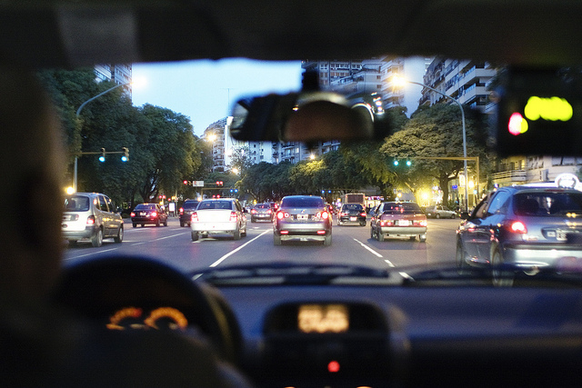

I'm currently at around 35,000 feet, somewhere between Buenos Aires and Puerto Iguazu. No, I'm not blogging from the plane, but rather I've set this post to publish while I'm up in the air.

I wasn't going to do another post before leaving for Iguazu Falls, but then I remembered my weekly Friday updates and wanted to get another in. So I thought that for this week's Friday update it would be fun to create a few lists about what I enjoy here so far, and what I miss the most.

### Things I Love About Buenos Aires

- The People - Everyone I have met here has been super nice, especially when they find out I'm from Canada. Canadians seem to have a universal reputation of being worldly and polite, and that goes a long way with everyone I've met.
- Being a Gringo - Argentine guys are known to be super aggressive and are for the most part rather sleazy (my friend was telling me a story about how an Argentine guy literally kept hitting on an obviously uninterested girl even as she walked into the bathroom). Which means as a foreigner it's pretty easy to meet girls since we don't act like Argentine guys.
- The Lavadero - Seriously, you can have someone else wash and fold your clothes for only a few dollars. It's amazing.
- Unlimited Culinary and Drinking Opportunities - We probably have a good deal of bars and restaurants in Vancouver, but I can only think of about 10 that I've been to in Vancouver that stand out. It seems like there's a popular pub on pretty much every corner in this city. In that regard it's probably more like Portland that Vancouver
- The Lifestyle - Unlike North America, people here only work as much as they have to. Nobody spends a lot of effort acquiring flat screen TVs, or fancy cameras, they simply work to live and then enjoy the rest of their time. That's why dinner here starts at 9pm and goes until 1 or 2am nightly, and why patios are usually full of people sharing a coffee or a beer amongst friends at all hours of the day

### Things I Miss From Home

- Driving - I enjoy walking, but I saw a photo of my car in storage the other day, and it made me miss being behind the wheel
- Pad Thai - I don't really eat Pad Thai back home that often, but I've been craving it lately and haven't seen any Thai restaurants here
- Friends and Family - This is a given, although I have to say that with Skype and iChat it's trivial to stay in touch these days
- Supermarkets - This is somewhat ironic because I've blogged about the importance of supporting local stores and mom and dad food productions. But I've gone out several times to get groceries for something, only to come back empty handed. We take it for granted back home, but it sure is nice being able to get all the groceries for a meal in one place.
- Coffee To-Go - There are a few Starbucks in the city, but other than coffee from there you don't really see people walking around drinking and eating in this city. In fact, there's no real street food that I can see, other than the odd hamburger place.
- Pizza - I really enjoy the pizza here, although it's far simpler than back home (not sure if that's deliberate or not). That said, I do miss a nice, fully loaded pizza, and have already been scouting out pizza joints for New York City
- Cheap Technology - After the currency crash in the early 2000s, Argentina imposed hefty import taxes on most items, including technology. At the bare minimum most technology here will cost twice as much, often much more. As a result I haven't purchased any lenses or anything, and will be waiting until I hit North America again

Things are great in Buenos Aires. I have about 39 days left here or so, and I'm sure that will go very quick. I have one more trip to take for sure, and that's to Ushuaia (the southern most city in the world). I may try to sneak in another one to Patagonia, but not entirely sure. Look for some photos after the weekend from Iguazu Falls.

Until then, enjoy the weekend!
