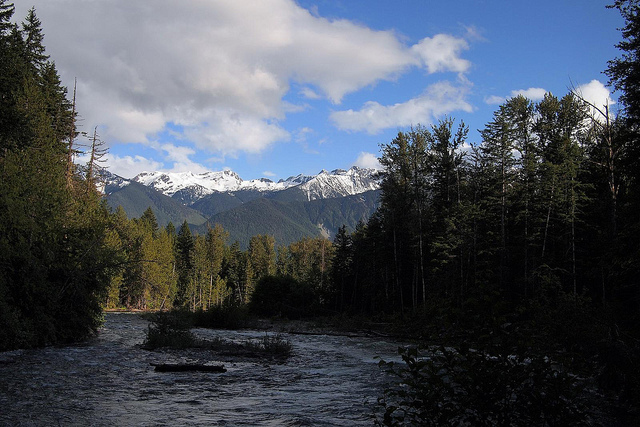

This last weekend my friend Dave and I made a hasty escape from the city and headed towards Pemberton. I ad a pretty rough prior week, as did Dave, so we were both looking to get away for a few days and simply enjoy some time in the outdoors.

The place we ended up going to is called Owl Creek, and it's a small campground about 15 minutes past Pemberton, BC. Usually when I'm up in that neck of the woods I head on up to Birkenhead Lake, but Owl Creek is about 40 minutes closer from Vancouver, and offers a nice bit of seclusion.

\[caption id="attachment\_8978" align="aligncenter" width="640" caption="The Birken River near Owl Creek"\]\[/caption\]

Despite forecasts calling for heavy rain, most of the weekend was a mix of cloud and blue sky. So we spent most of the days just chilling by the campfire, sipping some Howe Sound brewery beers, and chatting the days away.

If you're looking to get away from city life for a weekend and escape into a tent, then I'd definitely recommend the Owl Creek campground. There are only about six or seven sites, but the seclusion and lack of noise make for a great, relaxing weekend.
