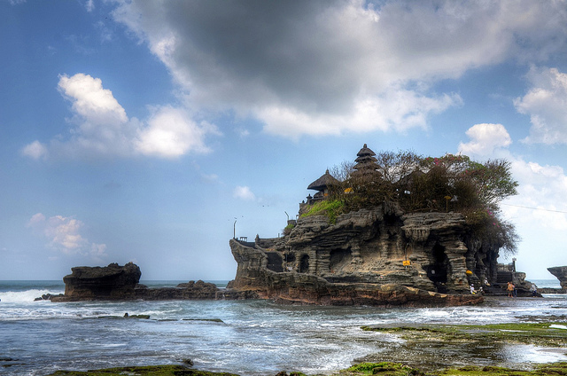

After visiting [Kuala Lumpur](http://themigratorynerd.com/2011/kuala-lumpur-malaysia/) for five days, I decided to take a three hour flight down to Bali, Indonesia. Bali is known as _The Island of the Gods_ due to it's amazing temples. It also happens to be a primary resort area for most Australians looking for an ocean-side vacation.

I spent my first few days laying low in the hotel, mainly to catch up on sleep after a fun, somewhat exhausting weekend in Kuala Lumpur. I was staying in a hotel in Sanur, which is a beach area on the south-east coast of Bali.

Ultimately I wanted to head to the cultural centre of Bali, Ubud, to meet up with a friend of mine from Canada. I figured that I may as well take advantage of the commute up to Ubud and see some of the sights on the island. I managed to find a great driver via the internet and rented his vehicle and his services for most of the day for a price of 450,000 IDR (about $50 CAD). So I woke up early in the morning, checked out of the hotel, then went on a little photographic adventure as I made my way up to Ubud.

The first stop was [Tanah Lot](http://en.wikipedia.org/wiki/Tanah_Lot), an ancient sea temple on the west coast of Bali. It's one of the most amazing locations I've ever been to, and it definitely feels like a sacred area.

\[caption id="attachment\_2416" align="aligncenter" width="640" caption="Tanah Lot"\]\[/caption\]

We then went on another drive to visit Taman Ayun, also known as the royal temple. There was also a large garden at the back of the template, and it was a beautiful area to visit.

\[caption id="attachment\_2417" align="aligncenter" width="640" caption="Taman Ayun"\]\[/caption\]

We then drove up into the mountains which were thankfully much cooler than down below. The driver let me out at a nice buffet restaurant with a terrace view of a huge rice field, and I sat in the corner and ate a delicious meal while the driver waited outside (I invited him in, but he was happy to just relax with some of his friends in the parking lot).

Afterwards we visited [Ulun Danu](http://en.wikipedia.org/wiki/Pura_Ulun_Danu_Bratan), another amazing temple located on the edge of Lake Bratan. One of the highlights of this stop was seeing a group of fisherman just standing in the water around the temple casually fishing the day away in front of such a majestic spectacle.

\[caption id="attachment\_2419" align="aligncenter" width="640" caption="Ulun Danu"\]\[/caption\]

While Bali isn't a huge island, the traffic is fairly congested in most areas and the roads are relatively small. So a 50 km ride can take up to 2 hours depending on traffic. So while the distances we covered weren't very sizeable, it took quite a bit of time to navigate between the various locations.

Eventually the driver dropped me off at my hotel in Ubud, which I thankfully splurged on. Having stayed in a hostel for five days (albeit a nice one) in Kuala Lumpur, and a fairly budget hotel in Sanur, I decided to treat myself to a nice $100/night hotel. It definitely didn't disappoint, and I had a huge room with 20 feet ceilings on the edge of a rice field about 4 kilometers away from civilization. I pulled off some of my smelly, sweat-soaked clothing and promptly plunged myself into the massive bathtub in the bathroom.

\[caption id="attachment\_2420" align="aligncenter" width="640" caption="Junjungan Hotel in Ubud"\]\[/caption\]

One thing we definitely take for granted in North America are hot showers. Back when I was in Chilliwack, I'd often take at least two hot showers a day, often three. For the most part, other than the first shower of the day, I would often take a later shower as a means to relax. And while there are showers in the accommodations I've come across on this trip, often the water has been lukewarm, and sometimes even just plain cold. To come across a shower that actually puts out _hot_ water is pretty rare so far, and I was definitely happy that the hotel I was at had hot water spurting out of the shower head, hot enough that I had to turn it down at one point.

After putting on some "clean" clothes (clean becomes a relative term when you're living out of a backpack for two weeks), I met up with my friend Robert for dinner at a fancy french restaurant and probably had the best meal I've eaten since leaving Canada (a nice juicy steak, of course). Afterwards we went out for drinks and then retired early since we both had a bit of traveling to do in the morning.

When I woke up I headed to the airport, said my goodbyes to the Island of the Gods, and boarded a plane for Singapore, which is where I am now.

All in all I had a great visit to Bali, and even managed to have a cup of [Luwak Coffee](http://en.wikipedia.org/wiki/Kopi_Luwak) at a coffee plantation at one point (the coffee featured in the movie _The Bucket List_). If you're in the area, then I definitely recommend heading down to Bali, which is actually a really affordable destination thanks to Air Asia and a few other low-cost carriers.
