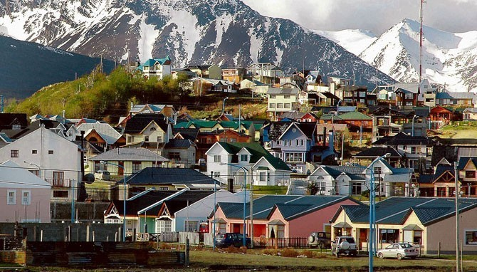

Next weekend I'm off to visit the southern most city in the entire world, Ushuaia, Argentina. From there, many people hop on a cruise ship and head down to Antarctica. It's an expensive trip to Antarctica, starting at around $5,000 a person, but spending a day or two visiting one of the most remote parts of the world is apparently well worth the price.

I will not be visiting Antarctica, but I will be visiting the Antarctica Hostel, located close to the Beagle Channel and in the shadow of the tail end of the Andes mountain range.

Ushuaia will obviously be the most south I've ever been in the world, but I was trying to figure out the most north I've been today. I did a road trip up to Dawson City years ago, which is at 64.04 degrees North. I also went to northern Finland a few years ago to a little town called Oulu, which is located at 65.01 degrees North. So Oulu wins for the north.

\[caption id="attachment\_7750" align="aligncenter" width="640" caption="Oulu, Finland"\]\[/caption\]

Ushuaia is located at roughly 54.8 degrees south. The total distance between Ushuaia, Argentina and Oulu, Finland is 15,559 kilometres, or roughly 20 hours of flying if you could fly directly between the two. I did a few other calculations, and apparently the furthest distance between any two cities I've traveled to will be between Ushuaia and Tokyo, a distance of around 17,013 kilometres.

\[caption id="attachment\_7751" align="aligncenter" width="670" caption="Ushuaia, Argentina, Photo from Wikipedia"\]\[/caption\]

Needless to say, I'm excited to be visiting a part of the world many people never get a chance to see. I'm hoping to go on a boat tour to see some penguins, which would probably be one of the highlights of my trip so far should it come to pass.
