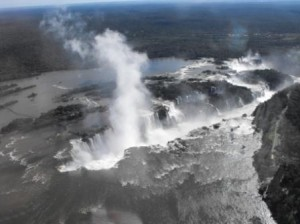

\[caption id="attachment\_1123" align="alignright" width="300" caption="Photo by Gerdschenkel on Wikipedia"\]\[/caption\]

This is my last blog entry until next week most likely. Friday afternoon I'm packing up some of my stuff and getting on a plane to Puerto Iguazu, a small city right on the edge of some of the nicest waterfalls in the world, Iguazu Falls. This will be my first real trip from Buenos Aires, and the first time getting on a plane again since I arrived.

To say that I'm looking forward to this trip would be an understatement. Ever since I saw my first photo of the falls a few months ago, I've been anxiously awaiting my chance to see them. So this weekend I'll finally get my chance.

Iguazu Falls is located in northern Argentina, right on the border of Brazil. You can see the approximate location in the map on the left.

I'm catching a plane around 3:30pm Argentina time and flying for a little less than two hours. From the airport it'll hopefully be a relatively short cab ride to the hotel from the airport. I'm just going to lay low Friday night, and will probably find a nice restaurant to just chill for a bit. On Saturday I'll spend the majority of the day over at the falls, and possibly even a bit on Sunday. I fly back to Buenos Aires in the early afternoon on Sunday, and should be back home around 6pm or so.

Because I'll be spending the whole weekend mostly around water, I'm not going to bring my laptop or iPad most likely. I'll bring my iPhone in case of emergencies, but other than a camera or two, will be mostly technology less.

I'll post photos from my trip on Sunday night or Monday - hopefully they are as impressive as the falls!

Update - here's my trip write-up after [visiting Iguazu Falls](/destinations/south-america/argentina/visit-to-iguazu-falls/).
