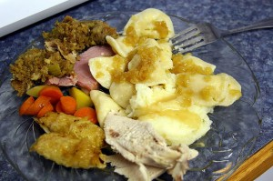

I'm hungry. Not in general, but for some of the comfort foods from back home. I've been told most people miss their friends and family when they are away from home for extended periods of time. But after a while, most people start to really crave some of the foods back home. I sure know I am. What kind of foods do I miss?

Bacon? It exists, but not it's more like fried ham.

Pizza? Simple thin crust only. Only ham and olive toppings mostly.

Breakfast food? Not really, mostly just breads and yogurts here.

Perogies. Nope, haven't seen any at all.

Thai food. Not really. In fact, rare to find anything spicy at all.

Sushi. Yes, but only with salmon for some reason.

When I first arrived, the food was a welcome change from North American food. It's definitely simpler food, but I imagine it's a lot healthier. But having been here almost three months now, I'm definitely craving some of the foods from back home. Most of the foods here aren't influenced by spices, so it's rare to get anything that's spicy or amazingly flavourful. I thought it was great that steaks here only had a bit of salt on them, but what I wouldn't give for a nice marinaded steak or one with a few dabs of BBQ sauce on it. At this point I'd probably trade my iPad in for nice big dish of pad thai.

So in about 21 days I'm going to pull a Nicolas Cage in New York City instead of Vegas, and with food instead of booze. Pizza, Burgers, Mexican, Thai, Japanese - I'm going around the world in four days baby.

If you happen to have any great New York City culinary destinations, then by all means please drop them below and I'll do my best to devour the entire restaurant when I arrive.
