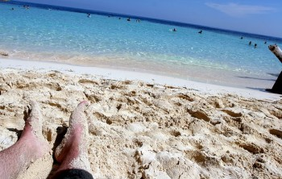

I wrote a post recently about [my travel metrics from the last six months](/2011/current-2011-travel-metrics/). One of the observations I made was that I had spent roughly $500 a month on average for airfare. Given that I gave my apartment up in British Columbia prior to leaving, airfare is one of my only extra expenses I have when I travel. Taken together with a $90 a month storage locker and roughly $50 a month in travel insurance, that's a rough cost of $650 a month that is in excess of what I would normally spend back in North America. If you do the math, a person will realize that they can actually make money traveling the world, at least when compared to the typical expenses they would spend back home.

But I also made the observation that it cost nearly $450 a month to keep my car on the road here in Canada. That breaks down to roughly $250 a month in gas, $150 in insurance, and about $50 in routine maintenance (oil changes, tire replacements, etc). I wasn't big on cable TV back home, but people who give up their apartment and other expenses such as cable will likely be able to add another $100 or $200 to this disposable income as well when traveling.

If you take both of my numbers together, the $650 I spend each month traveling and the $450 I save by parking my car for a while, you'll come to the semi-accurate conclusion that I'm basically paying $200 extra a month to travel to exotic countries around the world instead of sitting at home.

By itself, that's an uplifting observation. For the price of around $7 a day, many people could temporarily give up their lives at home and travel to exotic locations, pristine beaches, and experience some amazing cultures around the world.

But the story doesn't stop there: many beautiful places in the world are in fact much cheaper to live in than North America. For example, [Bangkok, Thailand is approximately 50% as expensive as Vancouver, Canada](http://www.numbeo.com/cost-of-living/compare_cities.jsp?country1=Canada&city1=Vancouver&country2=Thailand&city2=Bangkok). That means the $2,000 a month I spend on routine expenses in the Vancouver area translates into more like $1,000 a month in Bangkok, which is a savings of $1,000 a month.

If you add it all up, I'm effectively getting paid an extra $800 a month to live on a beach in Thailand for the next few months. Not a bad way to spend the fall if you ask me.

So if you're one of those people that loves to travel and has the luxury of working remotely, then you may want to consider a multi-month journey to an exotic country such as Thailand or Argentina. Not only are there life changing experiences to be had, but you're likely to save a pile of money in the process as well.
