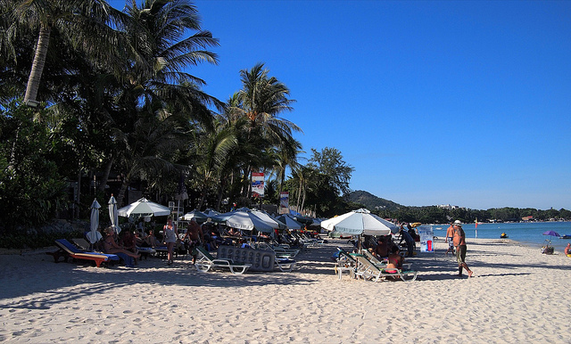

My phone gave me a warning last night that my Internet package was about to expire. That means I've officially been in Thailand one month now.

\[caption id="attachment\_2343" align="aligncenter" width="640" caption="Chewang Beach"\]\[/caption\]

I still have to do a write-up about my adventures in Chiang Mai, but I'm just waiting for a few of my photos to go up, as well as some Scott took with his point and shoot (I didn't take my SLR out around the elephants as it was a bit too dirty and wet for my liking). But hopefully this week I'll write a big post about my adventures up there, as it was a really good time.

\[caption id="attachment\_2344" align="alignright" width="232" caption="West side of Koh Samui"\]\[/caption\]

I have only four weeks left in Thailand. Yesterday I decided to go for a drive on my scooter and see some of the north part of the island. Once I got there, I decided to keep going until I hit the west part of the island. At that point it was just as far to keep going as it was to go back, so I did the full loop of the entire island on my scooter, around 50 kilometers or so. Other than some crappy roads near the south end of Koh Samui, it was a nice relaxing trip, often passing by water views and palm trees. Unfortunately I didn't have any sunscreen on, and I'm paying the price with some lobster-like arms and forehead today.

Scott and Sam are taking off this week down to Kuala Lumpur, which means I'm flying solo. I'm thinking about loading up my backpack and heading out for some exploration as well. One thing I've never done yet on my adventures is to travel without a safety net. In Buenos Aires, all my travel was done around the weekends and I simply took a day on one or both sides of the weekend to make the trips work. But I'm sort of at the point where I'm pretty sure I could function on my normal routine by simply staying in hostels/hotels and moving around with a backpack.

\[caption id="attachment\_2349" align="alignleft" width="231" caption="Waterfalls near Chiang Mai"\]\[/caption\]

I'm still debating what I want to do, but I'm thinking about heading to [Koh Phi Phi](http://en.wikipedia.org/wiki/Phi_Phi_Islands) for a few days. If not there, then maybe I'll take the ferry up to Koh Tao, which is home to some of the world's best snorkeling and diving.

I might delay everything a week, since ultimately I'd like to head to Singapore around the 17th for a few days to see one of my old friends from the Ottawa area (who just happens to have been relocated to Singapore for the same time I'm in Thailand - seems like fate that we meet up for a few beers). I'll also spend a night or two in Kuala Lumpur around then as well, since I've always wanted to check out the [Petronas Towers](http://en.wikipedia.org/wiki/Petronas_Towers).

But because Koh Samui is on an island, if you want to travel anywhere you typically have to fly off the island (and since it's a private airport, you pay about a 25% surcharge over flights from the mainland), or take a ferry back to the mainland. The ferry route is pretty cheap, but between that and the bus on the other side, it's definitely not a quick option. So once I'm off the island, it only makes sense to also head to the other places I want to visit as well such as Kuala Lumpur.

After going there, it'll basically almost be time to head up to Bangkok for a few days before flying down to New Zealand. It's definitely going to be a jam-packed month full of travel and hopefully lots of excitement. So far Thailand has been a really great experience and I'm definitely glad I decided to come for a few months.
