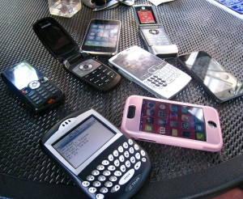

I'm sure most of us have some story about a friend of ours who got dinged several hundred dollars or more in roaming charges while out of the country. My friend Chris has a $6,000 bill in Australia, something that unfortunately still happens quite often due to amazingly high roaming rates in some countries. I've been fortunate in that I haven't been exposed to any high fees, and have in fact often spent less in other countries than back in Canada.

I spent some time speaking to Gillian Shaw on the phone yesterday regarding some of my experiences with my cell-phone abroad, and the article is now up. You can read [Keep Talking on Your Cellphone While Roaming Abroad](http://www.vancouversun.com/technology/Keep+talking+your+cellphone+while+roaming+abroad/5050625/story.html) to learn more, or follow along on [@migratorynerd](http://twitter.com/migratorynerd), [@duanestorey](http://twitter.com/duanestorey).
