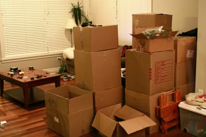

\[caption id="attachment\_1485" align="alignright" width="350" caption="Packing for Storage"\]\[/caption\]

When I left my apartment back in November of 2010, I put the majority of items into a 8x9x10 storage locker. I spent about a week selling off most of the big furniture (which would have been harder to store), and basically just ended up with a pile of boxes.

I didn't hesitate at the time to put all my belongings into storage. I knew I would be gone at least four months, and likely more. But it's now July, which means my belongings have been in storage for seven months. At a price of roughly $100 per month for the storage locker, that means I'm up to $700 to store a bunch of boxes.

At some point one needs to evaluate whether or not keeping some of those items is worth the cost. I had a friend who moved away years ago who put most of his items into storage as well. It's now three years later, and his belongings are still there. He basically admitted that he doesn't even remember really what's there, and he obviously isn't in any dire need of anything in the locker. At that point you really have to wonder if it's worth simply throwing everything out or trying to sell as much of it as possible.

I've been trying to go through my head to figure out what's actually in my locker. There's some camping stuff, quite a few boxes of kitchen gear, my stereo, my bed, some bedding, and some of my business paperwork. Other than my bed (which I would hate parting with for some reason), I'm not really that attached to most of the other items there. I would estimate that maybe I have about $2,500 worth of belongings in the locker, which means I've spent almost 30% of the total value of my belongings simply for the privilege of storing it.

I think I'll keep my storage locker for my next round of traveling, but will probably work towards getting rid of it immediately afterwards (assuming I don't decide to set up again back home). At that point in time I will have spent nearly $1,300 to keep $2,500 of stuff around, and the math starts to break down for me as to whether or not it's actually worth it. I'd miss the speakers to my stereo if I sold them, but nothing in my kitchen is really that important or expensive, so I could simply buy more stuff when I return.
