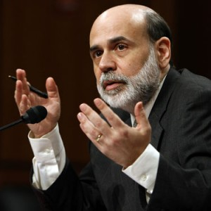

We're only about two month's away from the US hitting its debt ceiling of 14.3 trillion dollars. Congressionally the US isn't allowed to borrow any more than that amount (the entire wealth of the population of the planet is around 100 trillion dollars - so that means the US owes almost 15% of the entire wealth of the planet in debt).

The estimated date of this occurring is sometime in late April of this year I believe. When it does, the US has two options: default on some of their debt obligations, or raise the limit.

Raising the limit is financial suicide as the US has clearly demonstrated that it doesn't have any restraint when it comes to spending money. It would be the equivalent of giving someone with a really large credit limit on their credit card another credit increase because they are having trouble paying it off - it doesn't make any sense. Yet, that will probably be what happens, especially because of all the fear-mongering going on in the states.

Here are a few word-bites.

> Austan Goolsbee, chairman of the U.S. Council of Economic Advisers, said if Congress fails to raise the debt ceiling, the **“impact on the economy would be catastrophic.”**
> 
> William Daley, President Barack Obama’s chief of staff, said a failure by Congress to raise the legal limit on U.S. borrowing could be **“very dangerous”** and have **“enormous potential negative impacts on the markets.”**
> 
> Echoing comments from White House and Treasury officials, \[Ben\] Bernanke said last week that if Congress failed to raise the government's borrowing limit, it could force the United States into a **"catastrophic"** default.

Undoubtedly if the US starts defaulting on some of its obligations the markets and the world financial system will be cast into disarray. But the US really needs to make some hard decisions soon.

One of the best articles I've read recently about the debt crisis in the states is this one, [US Is Bankrupt and We Don't Even Know It](http://www.bloomberg.com/news/2010-08-11/u-s-is-bankrupt-and-we-don-t-even-know-commentary-by-laurence-kotlikoff.html) (the emphasis with bold is my emphasis):

> Let’s get real. The U.S. is bankrupt. Neither spending more nor taxing less will help the country pay its bills. .. But delve deeper, and you will find that the IMF has effectively pronounced the U.S. bankrupt. Section 6 of the July 2010 Selected Issues Paper says: “The U.S. fiscal gap associated with today’s federal fiscal policy is huge for plausible discount rates.” It adds that “closing the fiscal gap requires a permanent annual fiscal adjustment equal to about 14 percent of U.S. GDP.” .. Based on the CBO’s data, **I calculate a fiscal gap of $202 trillion, which is more than 15 times the official debt**. This gargantuan discrepancy between our “official” debt and our actual net indebtedness isn’t surprising. It reflects what economists call the labeling problem. **Congress has been very careful over the years to label most of its liabilities “unofficial” to keep them off the books and far in the future.** .. How can the fiscal gap be so enormous?
> 
> Simple. We have 78 million baby boomers who, when fully retired, will collect benefits from Social Security, Medicare, and Medicaid that, on average, exceed per-capita GDP. The annual costs of these entitlements will total about $4 trillion in today’s dollars. Yes, our economy will be bigger in 20 years, but not big enough to handle this size load year after year.
> 
> **This is what happens when you run a massive Ponzi scheme for six decades straight, taking ever larger resources from the young and giving them to the old while promising the young their eventual turn at passing the generational buck.**

That last paragraph is enlightening, especially because the US hasn't been actually been putting any money into Social Security - they simply write themselves an IOU for the amount each year.
