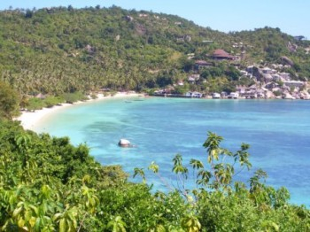

By the time this year is over, I will have spent nearly eight months away from home and on the road. I've been to South America, Europe, back to North America, over to Asia, and will soon be heading down to Oceania. I'll have close to 100,000 kilometers of flying under my belt by the time it's over, and will hopefully have my silver elite status. And yet despite all the traveling I have done though, I haven't really done much backpacking, other than the odd weekend trip.

Usually when I go see something new, I branch out from my home-base on a weekend and simply grab a hotel or a hostel for a few days. But something I've always wanted to do is to pack up my laptop into my backpack and simply hit the open road for a period of time. In fact, that was the whole reason I bought my 40L backpack in Canada before I left, so I could carry everything I needed to work in my backpack and also have it fit on a plane. So I've decided to set out on a little two week adventure to see how it all works.

\[caption id="attachment\_2356" align="alignright" width="350" caption="Ko Tao, Photo from Wikipedia"\]\[/caption\]

Friday afternoon I'm packing up my backpack and taking a catamaran over to Ko Tao, one of the world's nicest spots for diving and snorkeling. I won't have time to learn how to dive, but I'll definitely get out and do a bit of snorkeling on Saturday most likely.

On Sunday I'll take a boat back to Samui and then grab a flight over to Krabi, which is on the western part of Thailand. From there I'll take another ferry to the Phi Phi islands, one of which is ranked as one of the most beautiful islands in the world (another island was used for a James Bond film, and yet another for Leonardo DiCaprio's film _The Beach_). Most of the shots of Thailand with the blue/green water and the huge rocks jutting out of the water in the background are from Phi Phi.

\[caption id="attachment\_2358" align="aligncenter" width="800" caption="Kuala Lumpur, photo from Wikipedia"\]\[/caption\]

I'll be spending four days there, doing my usual routine of work and the odd bit of sight-seeing, and then I'll be taking a train down to Kuala Lumpur for the weekend. There's a hostel that I really want to stay at that has a roof-top BBQ and a view of the Petronas Towers. I'm already planning a long night-time exposure with my camera, so there should hopefully be lots of photographic opportunities.

At that point in time, my clothes will probably smell like ass, so I'll have to do some laundry. Once that's done I'll be getting on a plane and flying to Bali, Indonesia for a few days. I have a friend in Bali I might be meeting up with, otherwise I'll just check out the sites and enjoy some new culture.

\[caption id="attachment\_2361" align="alignleft" width="640" caption="Temple in Bali, photo by fabiogis on Flickr"\]\[/caption\]

From there I'll be boarding another plane and heading to Singapore to visit an old friend of mine from my JDS Uniphase days out in Ottawa. My friend Jan (who actually lives in Chicago) is there working for a few months, and he invited me down. So I figure I might as well take advantage of his hospitality and see another country.

After that, I'll head back to Samui and regroup with Sam and Scott. I'll have about a week left in Thailand at that point, so I'll start wrapping things up and getting ready to head up to Bangkok, and then down to Auckland, New Zealand.

I'll be on the road with only my 40L backpack full of stuff, and it's definitely going to be a new experience for me. I've also never been on a train while traveling before, so the long train ride to Kuala Lumpur should be pretty cool.

I'll try to give some updates every few days, since I'll be bouncing around enough that I'm sure I'll have plenty of stories to tell and photos to share. But the adventure begins Friday afternoon, starting with a two hour boat ride to Ko Tao.
