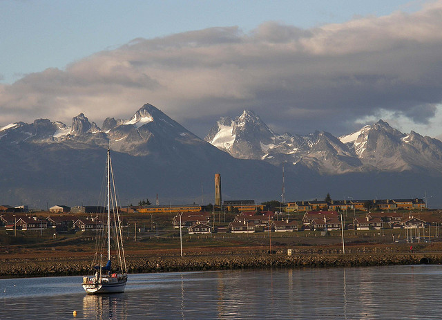

While I technically am leaving for Ushuaia in two days, for all intents and purposes (due to the early nature of my flight), I basically leave tomorrow evening.

\[caption id="attachment\_1316" align="aligncenter" width="640" caption="Photo by Stella Maris on Flickr"\]\[/caption\]

I'm excited about Ushuaia for lots of reasons. First, the weather is a lot colder down there compared to Buenos Aires. The high on Thursday is 9C, and the low is 6C. That's almost what the weather is like back home in Vancouver as well. While a lot of people like really hot climates, I'm not really one of them. I would rather be too cold than too hot - you can always put another shirt on, but if you're already sweating and not wearing a shirt there's not much you can do.

Second, St. Patrick's Day. Ushuaia has bragging rights on having the southern most Irish pub in the world. Since I arrive on St. Patties Day, I'm eventually going to make my way to the pub and have a few beers, hopefully with a few people from the hostel I'm staying at. I'm taking Friday off, so hopefully I'll be able to sleep in and recover from whatever debauchery happens the night before.

Third, this is my last real trip before I leave South America, and I'm looking forward to seeing and experiencing the southern most city in the world for a few days before leaving. As soon as I return from Ushuaia, I'll be down to the 7 day mark before leaving. That week will go super fast I'm sure, so Ushuaia will be my last big adventure before heading to New York City.

I have no idea what I'm going to do during the days, but visiting a penguin rookery is high on the list, as is a big boat tour of the Beagle Channel. I have a private room in my hostel, so I also may catch up on a bit of reading and writing (as much as I can without having my laptop with me). Apparently the hostel has a little bar where they sell beer, so a few impromptu card or board games while sipping a few brews might be on the menu as well. I won't have a computer, so I doubt I'll do any photo or blog updates while down there, but may be able to squeak a few tweets out.
