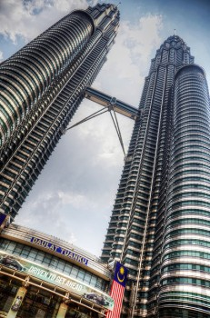

\[caption id="attachment\_2397" align="alignright" width="231" caption="Petronas Towers"\]\[/caption\]

I always knew I would be in Kuala Lumpur briefly, since I have a 9 hour connection there on my way to New Zealand. But outside of that I really wanted to make a trip down to Malaysia, if only to see the Petronas Towers in person.

Given that my laptop was dead in Phuket, I decided to simply head down to Kuala Lumpur early. I stumbled upon a really cheap flight ($50) on Malaysia airlines and booked it the same day. Five hours later I was getting off a plane in Kuala Lumpur and heading down to the [Reggae Mansion hostel](http://www.migratorynerd.com/destinations/asia/malaysia/reggae-mansion-hostel-review/) in Chinatown. Here is a summary of the time I spent visiting Kuala Lumpur.

### Reggae Mansion

I was originally looking for a hostel on the internet that was central to Kuala Lumpur and also had a view of the Petronas Towers. Eventually I found the highly rated Reggae Mansion hostel, which had an amazing roof-top bar with views of the KL Tower and the Petronas.

Without a doubt, my stay at the hostel was the highlight of my trip to Kuala Lumpur. After the first night of drinking, most of us became pretty tight in the hostel, often eating together and heading out in the evenings together.

The hostel is massive - inside is a full restaurant, countless dorm rooms, hallways full of private rooms, laundry facility, and even a 20-30 seat movie theatre which shows two movies a day. So there was definitely no shortage of things to do in the hostel.

In addition, there were two awesome girls (employed by the hostel) who went out of their way to make sure everyone was having a good time. So big thanks to Gemmy and Henney for the memories!

### Kuala Lumpur

Kuala Lumpur was a nice change from Thailand. It definitely has more of a first-world feel, even though it's a bit chaotic in certain areas. Thankfully the prices are still very reasonable, and most restaurant meals I had were around $5-6 CAD. Also, Kuala Lumpur is known as a shopping Mecca, so if you're into shopping to you drop, here is the place to do it for cheap. I bought a pair of sandals that probably would have cost $50 back home and only paid $20 in KL.

I didn't get to see too much of the outskirts, but I hung out a lot in Chinatown and around the Petronas Towers (the area known as KLCC). There's a huge shopping mall right at the base of the towers, so those looking to mix tourism with a bit of shopping can easily do so there.

The subway/metro system was fairly easy to navigate, although when I rode it the cars were completely packed and one even broke down (which meant we have to be removed and wait for another car to come get us). It was definitely a neat experience, but not one I'd be happy to repeat again given how hot it was.

If you're in Southeast Asia, then I definitely recommend spending a few days in Kuala Lumpur. It's a very unique city, and one that is vibrant, affordable, and full of great shopping and late-night adventures. I thoroughly enjoyed my time in the city, and fell asleep on the plane immediately after takeoff on my way to Bali, Indonesia.

If you're heading to Kuala Lumpur or Malaysia, then consider grabbing the [Lonely Planet Kuala Lumpur](http://www.amazon.com/gp/product/1741792169/ref=as_li_qf_sp_asin_il_tl?ie=UTF8&camp=1789&creative=9325&creativeASIN=1741792169&linkCode=as2&tag=duanestor-20) or the [Lonely Planet Malaysia](http://www.amazon.com/gp/product/1741798477/ref=as_li_qf_sp_asin_il_tl?ie=UTF8&camp=1789&creative=9325&creativeASIN=1741798477&linkCode=as2&tag=duanestor-20) guides to make the most of your trip to that region.
