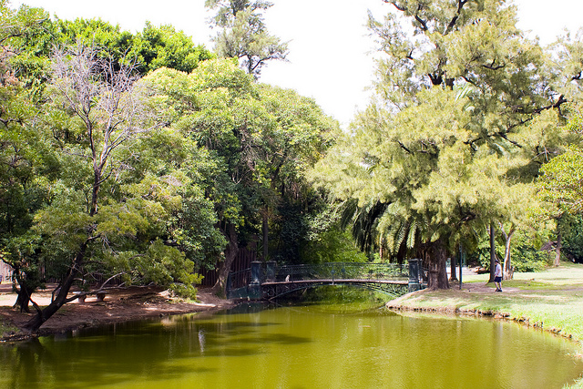

This last weekend I had the opportunity to visit the world renowned Japanese Gardens in Buenos Aires. Outside of Japan, they are some of the largest Japanese Gardens in the world, and I have been looking forward to visiting them ever since I arrived.

The Japanese Gardens are located in Buenos Aires, just north of the Palermo area and the Buenos Aires zoo. I walked there from my apartment near Paraguay and Gurrachuga, and it took me about 30 minutes or so to get there.

This was the first real trip I had done in Buenos Aires where I decided to take my digital SLR along with me. At the advice of a friend, I stowed my SLR in a backpack, and simply removed it whenever I needed to take a photo or so. The reason to do that is that walking around with a fancy SLR camera makes you a pretty easy target for pickpockets or thieves. Almost everyone who lives in the city has been the victim of petty theft at one time or another, and I'm hoping I can leave Buenos Aires without having to ever experience it.

Once I was inside the Japanese Gardens, I didn't mind walking around with my SLR camera, but outside I always made sure it was in my backpack.

The price to get into the Japanese Gardens was eight pesos (around $2), which I happily paid. There were signs that said something about photography being prohibited, but I saw a lot of people walking around taking photos, so I'm not entirely sure what it referred to. I've heard that you're not allowed to take photos of government buildings in Argentina, so it's possible that the entrance structures for the Japanese Gardens would fall into that category.

There is a pretty easy to follow path that leads in a huge circle around the entire garden, so I casually strolled along at a leisurely pace, stopping to take photos every few minutes. There were only about 50 people there max when I arrived, so mostly I didn't encountered too many people while walking around.

About 3/4 of the way through you encounter a little outdoor cafeteria, so I stopped and ordered a diet coke. I had a slight scare at that point, since after paying for it I realized I didn't know where my SLR was. Thankfully it was hanging from my shoulder, but as I've heard a lot of horror stories about cameras disappearing in a heartbeat in Buenos Aires, I've been a bit paranoid with regards to losing anything (especially since a friend of mine had her wallet stolen a few days ago here).

I spent about 20 minutes just soaking in the sun on the patio, and it was one of my most relaxing moments to date here in Buenos Aires. I was looking out over the gardens and there was a nice breeze blowing by. If I were a local here, I would definitely relax in that very spot every few weeks or so.

At that point, the sun started to come out, so I did another loop around the gardens and updated some of the photos that turned out a bit dreary due to the clouds. All in all I spent about 90 minutes at the gardens, and it's definitely worth seeing.

You can view a few more photos on [Flickr](http://www.flickr.com/photos/migratorynerd/sets/72157625704277023/).
