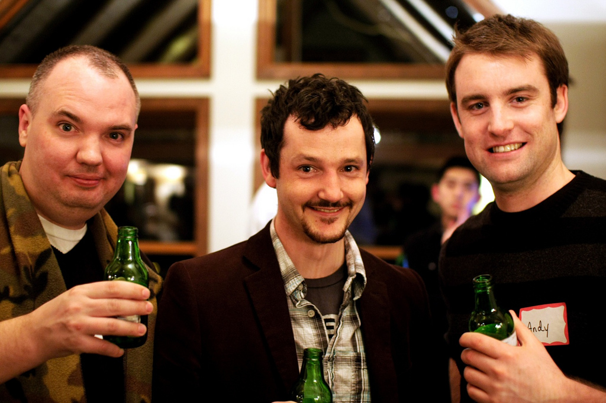

There's a new kid on the block in terms of Vancouver WordPress conferences, and that kid's name is [WordCamp:Developers](http://wordcampdevelopers.com). Unlike previous incarnations of WordCamp in the Vancouver area, WordCamp:Developers will have less content about the beginner aspects of WordPress (like the difference between .com and .org, which comes up at many conferences) and more content about advanced aspects of WordPress, such as development.

As many people know, I've helped organize three WordCamp conferences in the Vancouver area. The first was a small WordCamp Vancouver that was attached to BarCamp (which is no longer allowed - WordCamps have to be stand alone conferences), the second was [WordCamp Whistler](http://www.wordcampwhistler.com) and the last was [WordCamp Vancouver](http://www.wordcampvancouver.com) at the Museum of Vancouver last spring.

\[caption id="attachment\_8441" align="aligncenter" width="1024" caption="John Biehler, Dale Mugford and Andy Peatling, Drinking Beers at WordCamp Whistler"\]\[/caption\]

I've been both a WordPress attendee before and an organizer, but never a sponsor. So this time around Dale and I (via [BraveNewCode](http://www.bravenewcode.com)) have kicked in a bit of cash to help bring ticket prices down and to help contribute to what will undoubtedly be a great event.

Having dealt with the stress of organizing three conferences before, I have to say that it's a nice change being a sponsor and not really having to do much. But rest assured the WordCamp:Developers team is still working hard to make sure the event is special.

Many people from the WordPress community will be in attendance including myself, my business partner Dale (who is flying out from the Toronto area), [Rebecca Bollwitt (miss604)](http://www.miss604.com), [John Biehler](http://johnbiehler.com), [Lorelle VanFossen](http://lorelle.wordpress.com/) (who was our keynote speaker at WordCamp Whistler), Alex from Automattic (who has [created some of the more popular plugins for WordPress](http://www.viper007bond.com/)), Andy Peatling of ChickSpeak fame, and of course [all of these great speakers](http://wordcampdevelopers.com/speakers/). If anyone needs any routine advice with WordPress then by all means flag me down in between sessions and I'd be happy to answer a few questions for you.

So if you can spare a day on May 5th, then you should definitely grab a ticket and come check out the event. It's been nearly a year since the last WordCamp in Vancouver, and I'm definitely looking to catching up with everyone in the community.
