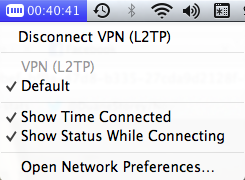

As many people know, I tend to travel quite a bit - over the last 18 months I believe I have visited on the order of 13 or 14 countries. And while there are always interesting things to do in each new city or country I visit, sometimes I miss some of the comforts of home (such as english TV or movies).

Back home when I am bored I typically watch Apple TV or Netflix. Unfortunately when I am outside of North America and I try to access Netflix I often end up with a message like this:

One way I've found around this is to simply tunnel all my traffic through a VPN server in the United States. The service I use to do this is [StrongVPN](http://strongvpn.com/aff/scripts/click.php?a_aid=duanestorey&a_bid=ca14b048), and an account costs around $55 USD per year.

The sign-up process only took me about ten minutes, and another five minutes or so to make it through their configuration tutorials for my operating system (complete with detailed screenshots). I found the instructions really easy to follow, and setting up the VPN network connection on my was extremely simple

Basically whenever I want to have all my traffic look like it's coming from the US, I simply enable the VPN connection on my Mac in the menu bar. Once it's connected (which takes about 5 - 10 seconds), all my traffic gets tunneled through a server in the United States. From the website's perspective (such as Netflix), they simply see inbound traffic from a US-based IP address, and simply assume that I'm located there.

Not only is this useful for accessing Netflix, but it'll also work for almost all websites that insist on someone being in a particular region. While I typically use a US-based server on [StrongVPN](http://strongvpn.com/aff/scripts/click.php?a_aid=duanestorey&a_bid=ca14b048), it is also possible to select servers in other parts of the world, including Europe. This is sometimes an advantage when it comes to sporting events that are streamed on the internet, as you can often bypass their location restrictions by choosing an appropriate server.

I have also had success using the VPN in various hotels around the world that tend to block specific computer traffic such as SMTP (which causes outbound sending of mail to fail). Since VPN traffic is typically encrypted, the hotels lose the ability to determine what information you are sending, so mostly it all makes it through as per normal.

So if you're looking to access Netflix from other countries while traveling abroad or for accessing any location-restricted sites (such as streaming sporting events and sometimes banking), then definitely check out [StrongVPN](http://strongvpn.com/aff/scripts/click.php?a_aid=duanestorey&a_bid=ca14b048). I've been using the service for almost two years now and it's worked extremely well for me.
