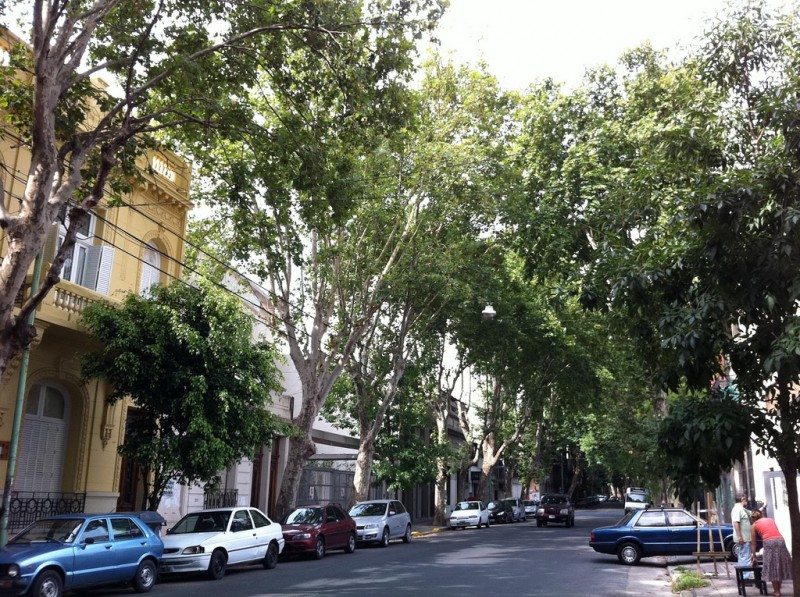

In just a few days I'll be leaving for the city of Buenos Aires again. As people who read this blog know, I started off this great travel adventure of mine last year in that very city. At the time I was a pretty green traveler, and struggled with the language and figuring out how the city worked for the first month or so of my trip. I was frustrated a few times, and a little disheartened with how hard it was at first to meet people. But I eventually overcame most of those obstacles, and probably grew as a person in the process.

When my three months were up in Argentina, I was looking forward to heading to New York and to Ireland. But I really enjoyed my time in Argentina, the people I met, and the culture I got to experience. Over the last year or so I've come to realize that I actually miss the city, the people and the lifestyle.

So I'm doing something now that I really have never done before - I'm heading back to a destination for a second visit.

I am definitely using my experience of the trip last time to make some changes for this trip.

First, I purposefully decided not to bring any nice camera gear last trip, thinking that it would just be a burden in my bag and one more item for people to steal. But I missed out on some really amazing photo opportunities in Argentina, and regretted that decision. As camera equipment is expensive in Argentina, I couldn't really go out and buy the gear I wanted at the time. So this trip I'm bringing a pile of my better camera gear, and am really looking forward to photographing the beauty of Buenos Aires and the people there.

Second, I'm bringing more clothes. It sounds like a simple thing, but I assumed on my last trip I would mostly be backpacking around Argentina and basically just brought a few shirts and jeans and thought that would be enough. I really didn't foresee the type of nightlife that was in Buenos Aires, or the different types of social activities I would find myself in (and unfortunately typically underdressed for). So this time I'm packing to live there instead of backpack there.

Third, I'm hoping to get involved in the technology scene there a bit more if possible. While I haven't figured it out yet, I'm hoping to give a talk somewhere in the city about WordPress or the Mobile Web.

And lastly, I'm bringing a guitar this time. I ended up having some time in the evenings to kill in Buenos Aires last time, and mostly I just walked around listening to music or reading books. But most of the time I really missed having a guitar around to play during those moments. I went out and looked at some guitars in Buenos Aires, thinking I might buy a cheap one, but I couldn't find anything I liked so I just decided to go without. This time I'll be bringing my Larrivee, which should make the trip down a little more interesting (I'm a bit paranoid about the process of traveling with it, having heard many horror stories of broken and lost guitars).

When I set out last year on my first trip, people said to me I would probably be a completely different person when I came back. I didn't really think that was possible at the time, but when I was packing my bag the other night it really did dawn on me how much things have changed, both for me and for these types of experiences.

I definitely am far more confident as a person, probably because of some of the challenges I've overcome this last year. I also have met many amazing people, most of which I'm happy to call my friends now, and that's one of the greatest aspects of travel for me.

Whenever you give someone that final hug goodbye in a foreign city, you are never quite sure if or when you will get to see them again. So I decided to make it a point going forward to try and make sure to stay in touch with the friends that I've met around the world, and part of that is heading back a second time to see everyone again in Buenos Aires.
