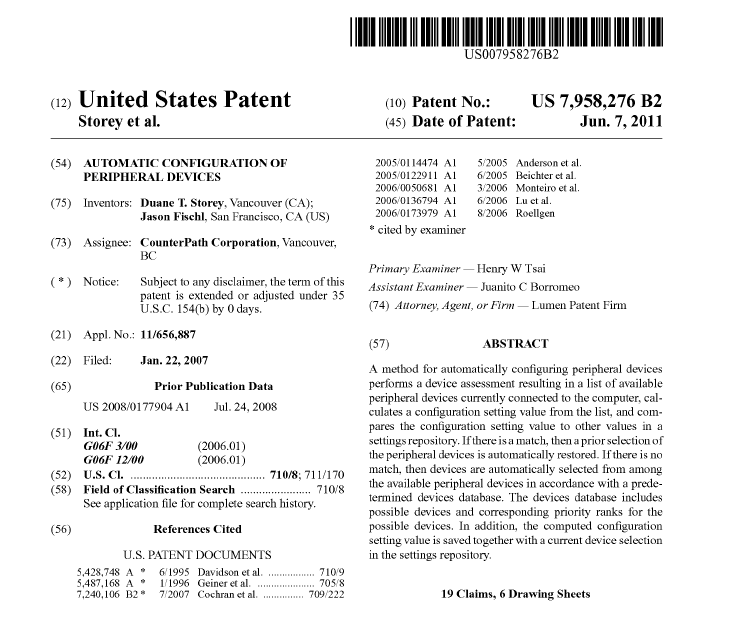

I was doing a Google search the other day, looking for some photos of me at the last company I worked at, when I discovered US patent 7,958,276, [Automatic Configuration of Peripheral Devices](http://www.patentmaps.com/topic/Automatic_configuration_of_peripheral_devices_1.html).

When I worked at my previous company I started playing around with an algorithm to automatically configure a voice over IP device. One of the main problems people would have previously is that they would plug in a new audio device and have to spend a pile of time figuring out how to configure it. The same was true with video. So at the time I came up with basically a complicated priority list that would place certain classes of devices above other ones. For example, if you plugged in a $200 Plantronics headset, I considered it pretty likely you would want to use that over the internal microphone and speaker, so it would be configured automatically.

Jason and I refined the algorithm over time, but essentially whenever you would plug in a new device, the software would automatically reconfigure itself based on the likelihood that certain devices should be used above other types of devices. It worked really well and definitely improved the end-user experience. At the time the company was pushing towards more intellectual property, so we decided to apply for a patent.

I had completely forgotten about it for a few years, and was actually a bit surprised when I found out last night that my first patent had been granted last year. I do find it a bit odd that nobody bothered to send me an email telling me about it, since there were various press releases mentioning it, but such is life.

Regardless, I am now listed as the primary inventor of my first (and likely, only) patent.
