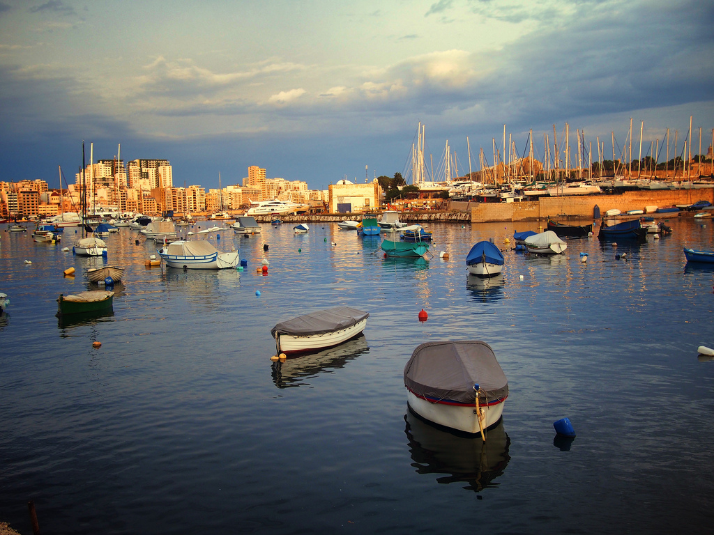

In August I decided to finally upgrade my Olympus E-PL2 micro four thirds camera (henceforth referred to as u4/3). While that camera had served me well for a few years, there was still something that really bothered me about its performance, and that was how it handled low light.

If you have no idea what a u4/3 camera is, then read on. Basically a few years ago some of the major camera manufacturers decided to come together and agree on a specification for a camera system that would have interchangeable lenses. Why this is important is that with the u4/3 system you can buy the camera body from one company and make use of a lens from another company. For anyone locked into a Nikon or a Canon system, this type of freedom will likely be a breath of fresh air.

Another major benefit is that u4/3 cameras employ sensors that are far larger than a normal point and shoot camera, coming close to the sensor sizes in many entry level SLRs, such as the APS-C format that Canon has. Ultimately what that means is that it's quite possible (and as you'll see, fairly typical) to take photos that are comparable to an SLR in terms of quality.

So when it came time to select another camera, my eyes immediately were drawn to a new offering from Olympus that was getting a ton of favorable reviews: the [Olympus OM-D E-M5 16MP Live MOS Interchangeable Lens Camera](http://www.amazon.com/gp/product/B0074WDFHM/ref=as_li_tf_tl?ie=UTF8&camp=1789&creative=9325&creativeASIN=B0074WDFHM&linkCode=as2&tag=duanstor-20).

While similar to the Olympus E-PL2 it was replacing, it had various important upgrades including improved low-light performance (my main gripe with the E-PL2), a tilting LCD, a fully electronic viewfinder (simply putting your eye near it activates it), and a very snazzy looking retro body, especially if you opt for the silver colour (which I did).

### My Olympus OM-D E-M5 Micro Four-Thirds Camera Review

I am no lightweight when it comes to photography. While I've never taken a formal class or been employed as a full-time photographer, I've owned a lot of the gear "the pros" use. I used to shoot with a full Canon kit, but switched this last year to a full professional Nikon kit. I did a lot of HDR photography in the Vancouver area, have photographed a few weddings, a few famous musicians, and even the Juno Awards (the Canadian equivalent of the Grammy Awards) once in Calgary.

The point I'm making is that I have a lot of photography experience, mostly with SLRs and professional high grade lenses. And after using the Olympus OM-D E-M5 for a few months, I'm seriously debating selling my entire professional Nikon setup with the intention of only using the [Olympus OM-D E-M5](http://www.amazon.com/gp/product/B0074WDFHM/ref=as_li_tf_tl?ie=UTF8&camp=1789&creative=9325&creativeASIN=B0074WDFHM&linkCode=as2&tag=duanstor-20).

It's that good - and here's why:

### First, It's Retro

\[caption id="attachment\_9748" align="alignright" width="300"\] Olympus OM-D\[/caption\]

First off, this camera just looks bad-ass. I'm sure it looks pretty good in black as well, but I think the silver looks awesome. And while I've never owned a silver camera like this before, once I saw it I had to have it.

I've had quite a few people come up to me and ask if this camera was a film camera, presumably because it looks retro enough to pass for an old camera. Not only is that cool from a nostalgia point of view, but I also find it comforting that these same people are likely assuming that it's a _cheap camera_, which it definitely isn't.

Since I spend a great deal of time traveling around the planet, it's important for me not to draw attention to myself as someone that has things that would be worth stealing. That's fairly easy to pull off when you're using this camera, but pretty much impossible to pull off when you're using a SLR with the external battery grip.

### Second, The Photos Kick-Ass

I'm not going to talk about image quality - instead I'll just show you.

\[caption id="attachment\_9752" align="aligncenter" width="1024"\] Trevi Fountain, Rome\[/caption\]

\[caption id="attachment\_9754" align="aligncenter" width="1024"\] The Coliseum, Rome\[/caption\]

\[caption id="attachment\_9756" align="aligncenter" width="1024"\] St. Peter's Basilica , Rome\[/caption\]

\[caption id="attachment\_9758" align="aligncenter" width="1024"\] Valetta, Malta\[/caption\]

\[caption id="attachment\_9780" align="aligncenter" width="1024"\] Sistine Chapel, Vatican City\[/caption\]

\[caption id="attachment\_9781" align="aligncenter" width="1024"\] St. Peter's Basilica from Rome\[/caption\]

\[caption id="attachment\_9783" align="aligncenter" width="1024"\] Sliema, Malta\[/caption\]

### Third, Low Light is Usable Again

The low-light performance of the E-PL2 wasn't that great. You could bump the ISO up and take shots when it was dark, but the photos were extremely grainy. Normally I can handle a bit of grain, but in this case I found the grain really abnormal looking, and almost offensive. So for the most part I didn't use the E-PL2 when out with friends in the bar and what-not.

The truth is that due to the small sensor size, the u4/3 format will never have as good low-light performance as the larger SLR sensors. But I was definitely hoping for more in the E-PL2, especially when coupled with the [Panasonic LUMIX G 20mm f/1.7 Aspherical](http://www.amazon.com/gp/product/B002IKLJVE/ref=as_li_tf_tl?ie=UTF8&camp=1789&creative=9325&creativeASIN=B002IKLJVE&linkCode=as2&tag=duanstor-20), which is the lens that stays on my camera 98% of the time.

\[caption id="attachment\_9762" align="aligncenter" width="1024"\] Friends in Malta, taken without a flash on the OM-D\[/caption\]

The [Olympus OM-D](http://www.amazon.com/gp/product/B0074WDFHM/ref=as_li_tf_tl?ie=UTF8&camp=1789&creative=9325&creativeASIN=B0074WDFHM&linkCode=as2&tag=duanstor-20) is very much improved in the area of low-light performance. So much so that I don't hesitate to take it out into a low-light situation, or feel the need to bring along my SLR as backup.

\[caption id="attachment\_9764" align="aligncenter" width="1024"\] Walking home in Malta\[/caption\]

It's still not as good as an SLR, for the reasons mentioned above, but it's a huge, huge improvement and definitely makes me much happier with the format.

### Fourth, Olympus Stands Behind It

You can always tell how good a company is based on how well they treat you after the original sale. Unfortunately for me, a few days after I received my camera, it fell out of my backpack and onto the concrete at an airport in Ontario, Canada.

My heart sank as I heard the familiar sound of glass breaking when it hit the concrete, and I was worried I had completely destroyed it. When I picked it up, it looked like this.

\[caption id="attachment\_9766" align="aligncenter" width="1024"\] Broken Olympus OM-D LCD\[/caption\]

Luckily for me the camera was still fully functional, but I had done a good job wrecking the LCD display. I managed to use the camera for a week or so while visiting Montreal, but promptly contacted Olympus when I got back to Vancouver and tried to get it fixed.

Due to the nature of the tilt LCD, apparently the OM-D needs to make use a special device to balance a replacement LCD on the old body. As such, the company I normally use in Vancouver to repair my cameras was unable to fix it, and had to forward it on to Olympus near Toronto. They contacted me about a week later and told me it would take about a week to fix, and would cost around $140. I was expecting quite a bit more money, and was pleasantly surprised with the cost considering the LCD is quite a bit more complex than other cameras.

All in all my camera was out of my hands for two weeks, but when it returned it was basically as good as new again.

### Final Thoughts

I \*like\* my DSLR and all my fancy lenses as well, but carrying it around takes a lot of effort, as does transporting it to a new location. Whenever I fly I am generally forced to fly with about 10 lbs of camera gear in my carry-on, which is a pain in the ass. I also worry about losing it (which has happened before, especially after a few beers), damaging it (I dropped a $1500 lens in a pool once), and am always paranoid about pulling it out in public, especially in areas of high theft (which was the case in various parts of South America - last year a photographer was stabbed and killed in Buenos Aires in broad daylight simply to obtain his SLR).

I absolutely \*love\* my [Olympus OM-D E-M5](http://www.amazon.com/gp/product/B0074WDFHM/ref=as_li_tf_tl?ie=UTF8&camp=1789&creative=9325&creativeASIN=B0074WDFHM&linkCode=as2&tag=duanstor-20). It's light, it's funky looking, it takes amazing photos, and most importantly for me, it makes photography fun again.

As I mentioned previously, I'm seriously considering selling my Nikon gear when I get back home. And while my [Olympus OM-D](http://www.amazon.com/gp/product/B0074WDFHM/ref=as_li_tf_tl?ie=UTF8&camp=1789&creative=9325&creativeASIN=B0074WDFHM&linkCode=as2&tag=duanstor-20) can't replace my entire Nikon kit, it can probably cover 90-95% of the cases now where I would normally want to use it.

Is it worth it having $6,000 worth of Nikon gear sitting around collecting dust, only to shoot that final 5% that I can't cover with the OM-D? For some people, maybe. But for me, I don't think it is. For around $1,200 I can buy a professional quality f/2.8 zoom lens for the u4/3 body. I can then pocket the difference and use it to fund some of my other hobbies, or possibly further invest in the u4/3 line-up.

\[caption id="attachment\_9770" align="aligncenter" width="1024"\] Pantheon, Rome, shot with the Olympus OM-D\[/caption\]

In short, the [Olympus OM-D E-M5](http://www.amazon.com/gp/product/B0074WDFHM/ref=as_li_tf_tl?ie=UTF8&camp=1789&creative=9325&creativeASIN=B0074WDFHM&linkCode=as2&tag=duanstor-20) is my favorite camera I've ever owned to date - it is an absolutely joy to own, fun to use, and the photos are amazing. I am ecstatic with my purchase, and can't wait to continue taking photos with it as I travel around the world. While I may not end up selling all my Nikon gear, I can say with absolutely certainty that I will likely never take my Nikon SLR on an airplane again for a personal trip - with the [Olympus OM-D E-M5](http://www.amazon.com/gp/product/B0074WDFHM/ref=as_li_tf_tl?ie=UTF8&camp=1789&creative=9325&creativeASIN=B0074WDFHM&linkCode=as2&tag=duanstor-20) in my bag, there's really no reason to.

If you're looking to purchase this camera, then check out the latest [Olympus OM-D E-M5 price on Amazon](http://www.amazon.com/gp/product/B0074WDFHM/ref=as_li_tf_tl?ie=UTF8&camp=1789&creative=9325&creativeASIN=B0074WDFHM&linkCode=as2&tag=duanstor-20).

I also recently purchased the [Panasonic Lumix G X Vario 12-35mm f/2.8 aspheric](http://www.amazon.com/gp/product/B00843ERMW/ref=as_li_qf_sp_asin_il_tl?ie=UTF8&camp=1789&creative=9325&creativeASIN=B00843ERMW&linkCode=as2&tag=duanstor-20) lens, which has basically transferred my Olympus OM-D into the equivalent (in my opinion) of my old Canon with L-series lenses such as the 24-70 f/2.8L. If you want a pro-series lens for a micro four-thirds camera, then definitely check it out.
