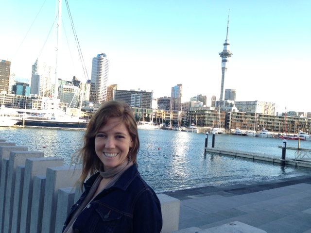

A little over 24 hours ago we boarded Air New Zealand flight 83 in Vancouver for a 14-hour trip back to Auckland, New Zealand. I spent four weeks in Auckland about two years ago and really enjoyed myself. My original plan at the time was to slowly make my way south to the South Island and spend some time in a CamperVan, but eventually decided against it because I couldn't find anyone to share the adventure with me.

\[caption id="attachment\_12278" align="alignright" width="640"\] Luciana in Auckland\[/caption\]

Thankfully now I have a girlfriend, and she was excited to spend a few weeks in a CamperVan in New Zealand. So we booked a three week trip back to New Zealand, and are currently in Auckland getting ready for New Year's Eve.

We are here until Friday, at which time we will likely take a bus to Matamata and spend part of Saturday back at the set of Hobbiton. I was there two years ago before the first Hobbit movie was released, but rumour on the street is that they now serve beer in the Green Dragon pub, so I really need to make a return visit to sample it out. I did a bit of research and they are actually serving some old fashioned ales, which will be an interesting change. Luciana also has never seen Hobbiton before, so she's excited as well.

\[caption id="attachment\_12280" align="aligncenter" width="1024"\] Hobbiton in Matamata, New Zealand\[/caption\]

After Hobbiton we will likely head to [Waitomo](http://www.waitomo.com/waitomo-glowworm-caves.aspx) to see the glowworm caves, and then make our way down to Wellington. There's a somewhat famous movie theatre in Wellington called the Empire Theatre that was rebuild to host the world premiere of Return of the King. Since they allow you to drink beer in movie theatres here, I'd like to check out a movie in that theatre while in Wellington, most likely a second viewing of The Hobbit: The Desolation of Smaug (when in Rome and all).

We'll then take the ferry to the South Island to pick up our [Jucy Cabana](http://www.jucy.co.nz/vehicles/jucy-cabana.aspx) in Christchurch for a two week camping road trip. I'm actually taking two weeks off for that, so it'll be nice to just relax and take in some of the amazing South Island scenery.
