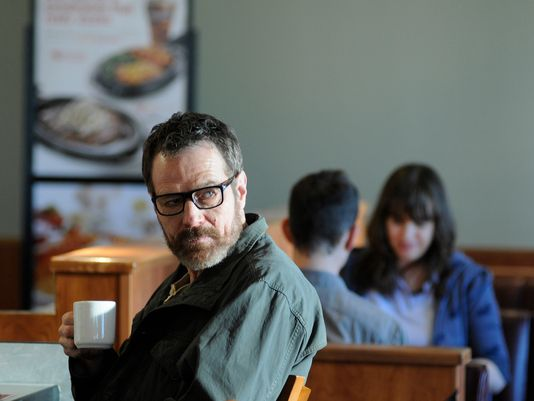

\[caption id="attachment\_11833" align="alignright" width="534"\] Walter White's Last 75 Minutes\[/caption\]

I've been reading a lot of Breaking Bad predictions these last few days and I thought I would toss my own hat into the ring. I'm sure I'm going to be wrong on a few counts, mainly because the writers have been really great at surprising us.

There are lots of spoilers here, so don't read any of these if you aren't totally caught up with watching Breaking Bad.

Here's what we know based on the end of the last episode:

- Andrea, the girl Jesse was dating, was murdered by Todd, and Brock is now motherless
- Jesse is being held captive by Jack, Todd and their crew and is making 96% pure meth
- Walt's family no longer wants anything to do with him
- Walt is heading back to Albuquerque, and will pick up a M60 machine gun along the way
- We saw Walt acquire the ricin in a previous flash-forward, which means he's using it on someone in this episode

Ultimately I think this episode will have two big themes: vengeance and redemption. I think we're going to see Walt try to destroy the entire Meth empire he helped build up systematically, and I also think we're going to see him try to redeem himself, maybe in a small way to his family, before he eventually checks out.

So without further ado, here are my Breaking Bad finale predictions.

### The M60 Machine Gun

_My Prediction: Jack and his crew_

Walts picks up a M60 machine gun in one of the previous flash forwards. The obvious choice for it is that it's intended for Jack and his crew, which is my prediction as well. Given that they stole most of Walt's money, which was really the prime reason he got into the meth trade initially, I think he's going back to serve a few dishes of revenge. My only caveat to this is that Walt's not really the fighter type, but Jack's crew definitely has fighting experience. So really Walt is heavily mismatched with even a M60 machine gun. So I'm thinking he'll either have to acquire some help to take down Jack and his crew, or otherwise he'll have to resort to some science or chemistry.

And as much as I'd like to see Jack and his crew hit with an M60, it does feel like a little bit of a cop out compared to where we started with Walter White. One of my favourite episode in previous seasons was when walt brought the fulminated mercury into Tuco's place and ended up blowing up the whole apartment. So I'm hoping at the end it's not just Walt haphazardly shooting a machine gun at Jack and his guys.

### Todd's Fate

_My Prediction: Jesse opens a can of whoop-ass, chemistry style, on Todd_

We've come a long when from the first episode where we meet Todd and he tells Walter and Jesse about the nanny cam in the house they are fumigating. Since then he's killed a little boy in cold blood, locked Jesse up in a dungeon to cook meth, and recently put a gun against Andrea's head and killed her right in front of Jesse. So if anyone on the show deserves to die horribly, it's Todd.

I think ultimately Jesse is going to extract his vengeance on Todd, but I'm not entirely sure how. We know Walter used the red phosphorus to take down Crazy Eight in earlier episodes, so perhaps Jesse will be able to do the same. But I suspect Jesse will use whatever is at his disposal in the meth lab to finally rid the world of Todd, and it might likely involve some of the chemicals there.

### Lydia's Fate

_My Prediction: She's a goner, but not sure how_

Lydia is a key player in this last episode, but I really have no idea what will happen to her. Some people seem to think that Walt will use the ricin on her and disguise it as some Stevia in the coffee shop. It's definitely possible, but I have issues with it for a few reasons. First, Walt really has no reason to contact Lydia again. He's not making Meth, and she doesn't need him at all. So I think she would be an idiot to go to any meeting with Walt. And even if she did, you can bet Todd, Jack and the crew would hear about it, so I doubt Walt would make it out alive from any meeting he went to.

This ties into my prediction for what happens with the ricin, but I think Lydia is going to be taken down by the police. Either that or someone in Jack's crew, but that's not as likely in my mind. So I think Walt may end up selling her out to the Feds in order to shut down the entire Eastern Europe distribution chain for the Blue Meth.

### Jesse's Fate

_My Prediction: He escapes, and sets out to help Brock_

If anyone deserves some sort of redemption it is Jesse. That guy has been through hell, especially lately. His hands are stained with blood too from the number of people who are dead and affected by the Meth empire he helped start, but often he was just floating about in Walt's wake.

I think he's the one who is going to get rid of Todd, and Walter is the one who will get rid of Jack and his crew. It's possible Jesse will kill Walt at this point, since he absolutely despises him, but I think at the end they are going to go their separate ways. Either way there's a huge confrontation coming between Walt and Jesse in this upcoming episode.

There's some speculation that Jesse will escape and then set off to live with Brock. That's only possible in my mind if there really is no time delay between the end of the last episode and the start of this one. But that would mean the Meth trade would be in chaos again by the time Walt returned to New Mexico, so I don't think it's very likely.

So we'll see what happens. But ultimately I think Brock is going to factor into Jesse's future somehow, assuming he escapes.

### The Ricin

_My Prediction: Walt ingests it himself_

There has been a lot of speculation on the Internet that Walter is going to use the ricin on Gretchen and Elliot due to the interview we saw at the end of the last episode. I don't think that's the case though. It's plausible for sure, but I think we just have too many other more important threads to tie up in these last 75 minutes.

Walter also knows that his Blue Meth is now on the market, and it's still reaching as far as eastern Europe. He knows that one or both of Todd and Jesse is likely involved, since they have first hand knowledge on how to prepare the Blue Meth, and he definitely knows that Lydia is involved, since the Blue Meth is showing up in eastern Europe again.

This is where things get a little grey, because we don't really know what Walt's motives are any more. Walt knows that he's dying, and his family doesn't want anything to do with him, so he really doesn't have anything to lose at this point. But what does he have to gain in this last episode? He can't really take over the meth business anymore due to his health. He can't get any of his money to his family either since the feds are watching, and we know that Walt Jr. doesn't want any of it anyways.

We also know that Skyler's life isn't looking very rosy right now. She's been evicted from the old house, and she's working as a taxi dispatcher. The feds are watching her, hoping for Walt to contact her. And she likely has a whole pile of legal issues still forthcoming. So I think at some level Walt is going to try and help her out, and the only way he can do that in my opinion is to turn himself into the authorities at the end of all of this.

And I think Walt will ingest the ricin right before he does, so that way he can spare himself the embarrassment of going to court and possibly doing any jail time. That way his family will be out of the spotlight and he will exit the world on his own terms.

It's been a great five season run, and I'm looking forward to seeing how it all plays out before the curtain comes down forever. Unlike Lost, which disappointed many people during its final episode, I think Breaking Bad will have a satisfactory conclusion. The director has said the will essentially be like Scarface, and we know at the end of that basically everybody died in a blaze of glory. But we'll see shortly.

If you're a fan of the show, let me know what you think is going to happen, or if you think I'm wrong. I suspect I'm wrong on at least half of these, but I'll know for sure soon.
