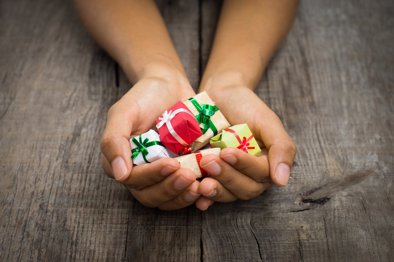
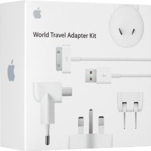

It's November 1st, which means that shortly we are going to start seeing Christmas lights, trees, and of course all the great sales leading up to Christmas. It's only about 7 weeks away now, and I'm sure that time will go by quickly.

\[caption id="attachment\_12097" align="aligncenter" width="800"\] Christmas Presents for Travel\[/caption\]

After travelling the world for almost three years now, I thought I would share some of my best ideas for Christmas presents for people like me. If you have someone in your family that loves to travel, or is thinking about taking a big trip, then hopefully this list will help you. I've ordered it by price, lowest to highest, so hopefully there's something here for all budgets.

So without further ado, here are some great presents for people who like to travel.

1. #### [How To Travel The World on $50/day](http://amzn.to/16RpOEY) - $8
    
    
    
    Written by famous travel blogger Matt Kepnes (known on the internet as [Nomadic Matt](http://nomadicmatt.com)), this book describes what you need to do to travel around the world for only $50 per day. I read it recently as well, and agree that it can be done. Certain destinations as much more expensive than that (Australia and New Zealand for example), but if you include really cheap places as well, such as Thailand, a person could definitely travel for only $50 per day on average.
    
    This is a great introductory book for anyone who loves travel and is thinking about going off on an adventure, no matter what age. It's probably a great book as well for people about to start their gap-year.
    
    If you're interested in grabbing it, you can [find it here](http://amzn.to/16RpOEY).
2. #### [Passport Cover](http://amzn.to/1aMm4BZ) - $16
    
    I recently pulled my Passport out of my wallet here in Portugal and managed to snag the front page on my jeans, causing it to rip. Since it's the main page of the passport, technically countries could now deny me entry upon arrival. So take it from me, you want to protect your passport somehow while you travel.
    
    This leather passport cover is a great way to try and keep your passport looking better than mine.
3. #### [Apple World Travel Kit](http://amzn.to/1cGLO77) - $33
    
    
    
    A friend of mine bought this present for me a few years ago, and it's been absolutely great to travel with. It contains various Apple-friendly adapters for all the plugs you'll likely encounter around the world. Since all Apple devices support dual voltage (120V/240V), all you have to do is change the plug whenever you land somewhere new, and you can easily charge iPads, iPhones and whatever Apple laptop you have.
    
    If you're interested in the travel kit, you can [find out more here](http://amzn.to/16RpOEY).
4. #### [Mophie Juicepack Powerstation Duo](http://amzn.to/1cGLO77) - $99
    
    
    
    This device was a recent addition to my travel kit, and I use it all the time. Basically you can use the Mophie Powerstation Duo to charge any USB device while you are travelling. A great bonus with this particular version is that you can charge more than one device at once, perfect for couples who travel together. The Mophie Powerstation Duo has enough power to completely charge two iPhones two times (or one iPhone four times). It comes with a charging cable (surprisingly it's not a typical USB cord), and easily fits inside a typical laptop bag.
    
    So make sure the person you love is never without a charged phone after this Christmas. You can [find out more here](http://amzn.to/1ctMh9u).
5. #### [Kindle Fire 7"](http://amzn.to/1h5s8gh) - $139
    
    Everyone who travels should have some type of an eBook reader, since often you'll be stuck waiting for trains, busses, and airplanes. Plus if you're in a foreign country, sometimes you won't be able to find any local books or newspapers that you can read. I personally use the Kindle App on my iPad (discussed later), but for someone who doesn't have an iPad, the Kindle Fire is a great option for them.
    
    You can simply buy books from Amazon, even while travelling, and they'll instantaneously show up on your device for reading. [You can grab the Kindle Fire on Amazon](http://amzn.to/1h5s8gh).
    
6. #### [Osprey Farpoint 40L Backpack](http://amzn.to/1dxhkTf) - $148
    
    I've seen two trends emerge over the last few years regarding how much stuff people take when they travel. Some groups of people seem to be travelling with more and more stuff, often wearing a backpack on their back and another one on their front for balance. To me that's insanity. To most people I know who travel, the more you bring the less likely you are to enjoy yourself. Try going up 8 flights of stairs carrying all of that (in many parts of the worlds you don't find elevators) and see how happy you are that you brought 20 pairs of jeans with you.
    
    The other trend is towards minimalism, which I am a big fan of. Most people who bring a lot with them their first trip quickly realize that they hardly use any of it, especially clothes. With that in mind, I recommend a backpack like this since it's large enough to hold a week's worth of clothes (which is all you need - just do laundry every week) and it is still small enough to fit on the plane as carry-on.
    
    I'll be heading to Australia and New Zealand in the new year for a six week adventure, and I'm only going to bring a backpack for it.
    
7. #### [Nest Thermostat](http://amzn.to/1dXkFh7) - $249
    
    
    
    Wait, what? Why is a thermostat on this list of cool presents for traveller? Because it's awesome, that's why.
    
    I have one of these on my wall back in my apartment near Vancouver, Canada. Whenever I want, I can log into it via my iPhone and adjust the temperature. I can also set up a schedule via my phone and their website to try and minimize power usage while I'm away from home, and also impose various minimums (for example, you can force the A/C to go on if it gets too warm inside, or force the heat to go on if it's too cold so that your pipes don't burst).
8. #### [Apple iPad (Retina Display)](http://amzn.to/1izYISU) - $470
    
    I typically travel with both a laptop (a Macbook Air) and an iPad, but I know many people who choose to only travel with an iPad. If you're simply replying to emails back home and browsing the web occasionally, the iPad is the perfect travel companion.
    
    I also do quite a bit of reading on the Kindle application that I installed - that way I can buy new Amazon Kindle books whenever I'm bored and read those. It's a perfect gift for a solo traveller who might be a long ways from home. You can [check it out here](http://amzn.to/1izYISU).
9. #### [Olympus E-PL5 Digital Camera w/ Kit Lens](http://amzn.to/1aO8rnR) - $599
    
    My first travel camera was a huge digital SLR. It was heavy, bulky, and attracted unwanted attention whenever I took it out to snap a few photos. When I got back home that year I immediately went out and purchased one of the Olympus E-PL cameras, an older version of the one above. It's the perfect size for travelling, and the photos are absolutely gorgeous since they use larger sensors than most entry-level cameras.
    
    If you know someone who likes taking photos and also travel, then this series of cameras is the perfect gift for them. [Check it out](http://amzn.to/1aO8rnR).
10. #### [Apple Macbook Air Laptop](http://amzn.to/1h5rnnl) - $1,050
    
    Nothing says love quite like a $1,000 Apple laptop. Imagine their surprise when they open this bad boy up at Christmas time, and all the adventures they will have with it in their backpack. My Macbook Air is with me during every trip I take, and it's great to video chat with friends and family back home, as well for all the work I do while I travel.
    
    If you feel bad about how much money you are spending, don't worry - just spend some time drawing your own Christmas card for them to go along with the gift.
    
    You can read more about the [Macbook Air here](http://amzn.to/1h5rnnl).
