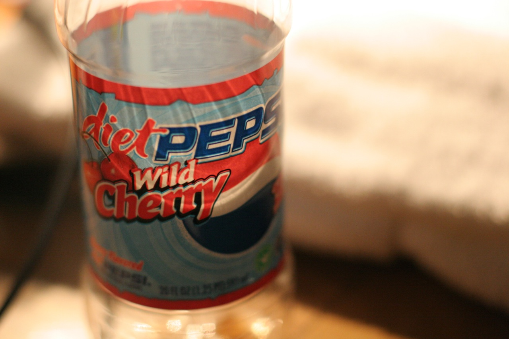

For many software developers, grabbing a can of soda is far more natural than grabbing a glass of water. At several companies I've worked at previously the employers even stocked the fridges with free soda. So when given a choice between grabbing a can from the fridge or getting a glass and going to the water cooler, often soda was chosen, especially in my case.

When I was younger I never gave much thought to how much soda I consumed, but definitely in the last few years I've been more conscious of just how many bottles of diet soda I go through. I remember a period of time where I would show up at work and pretty much drink a 2L of diet coke every day when we were developing a huge software product. Not only is that an awful lot of chemicals to put into one's body, but it's also a fairly large amount of caffeine.

I was reading some recent studies that seemed to indicate that aspartame wasn't much better than sugar at preventing weight gain (in fact, several studies showed the opposite - that artificial sweeteners, through some assumed chemical means, can actually lead to weight gain). I used to use Splenda (which is assumed to be better than aspartame) but gave it up over a year ago because it caused me intestinal distress from time to time.

Giving up diet soda and artificial sweeteners is a pretty big undertaking for me. I have used artificial sweeteners for probably at least 10 years, and have been drinking soda consistently every day for close to 15 years. So I wasn't really sure what the withdrawal process would be like, or if I would feel any better.

### Four Weeks Later

It's been about four weeks since I gave up both. I actually tapered my soda consumption down over about a week to minimize the withdrawal symptoms from caffeine (which I'm familiar with), so I wasn't really worried about getting headaches or anything like that. Also, my plan wasn't to give up caffeine, just soda - I still have been enjoying a morning coffee, I just haven't been putting anything sweet into it.

I didn't really notice anything for the first few days, other than craving soda from time to time. After a few days though I started getting some really bad heartburn/acid-reflux after eating. It got bad enough that I started taking daily antacids to help minimize the burning sensation. I suspect it's because my body was adjusting to not having a daily intake of acid (soda contains carbonic acid), but I'm not entirely sure. I found similar stories by a few other people after googling it.

That lasted about two weeks, and thankfully now I am mostly heartburn free.

I haven't really noticed much of a change from giving up the artificial sweeteners. My weight has probably gone up slightly, but that's more likely associated with three weeks of binge eating and drinking since I was on vacation. I used to get some intestinal distress from time to time over the last few years, and I haven't noticed that at all since giving both up, so it's possible this is a positive affect associated with giving up the sweeteners.

One thing I have noticed is that my sleep quality seems to be improved. I still wake up from time to time during the night, but I tend to dream far more often than I used to - I have even managed to mostly sleep through the night a few times. That's definitely a big improvement from where I was a few years ago.

So in short, I'm happy that I've managed to give both artificial sweeteners and soda up over the last four weeks. I've always felt that consuming as much as both as I used to wasn't a good thing from a health perspective, and now that's something I no longer have to worry about.
