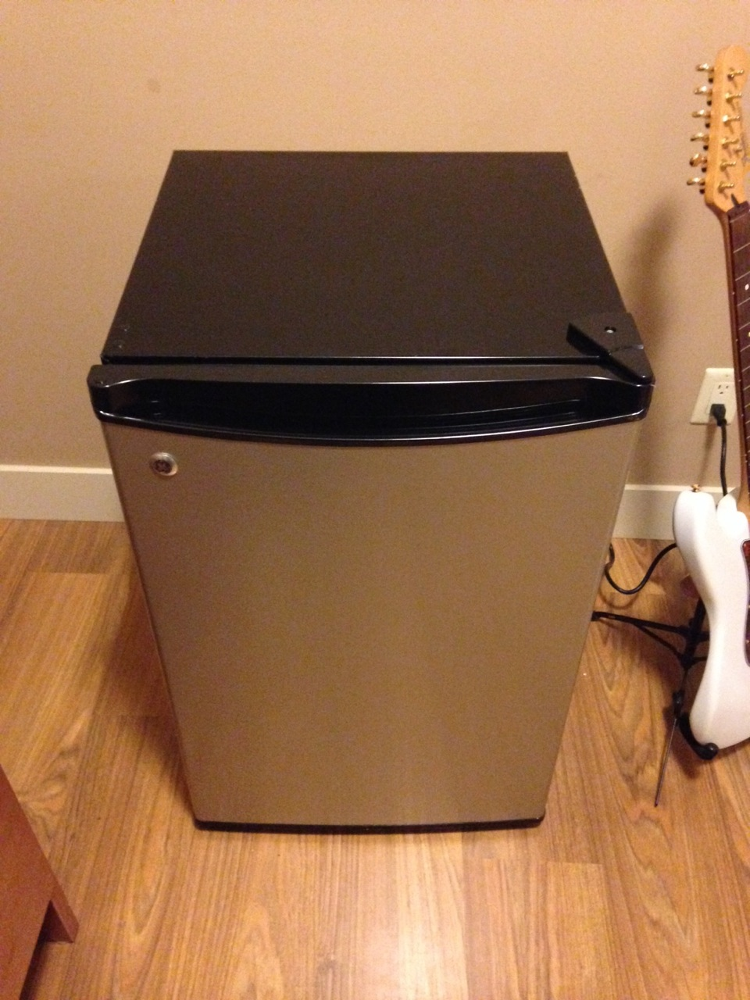
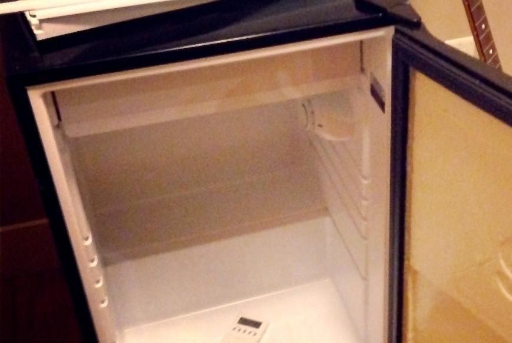
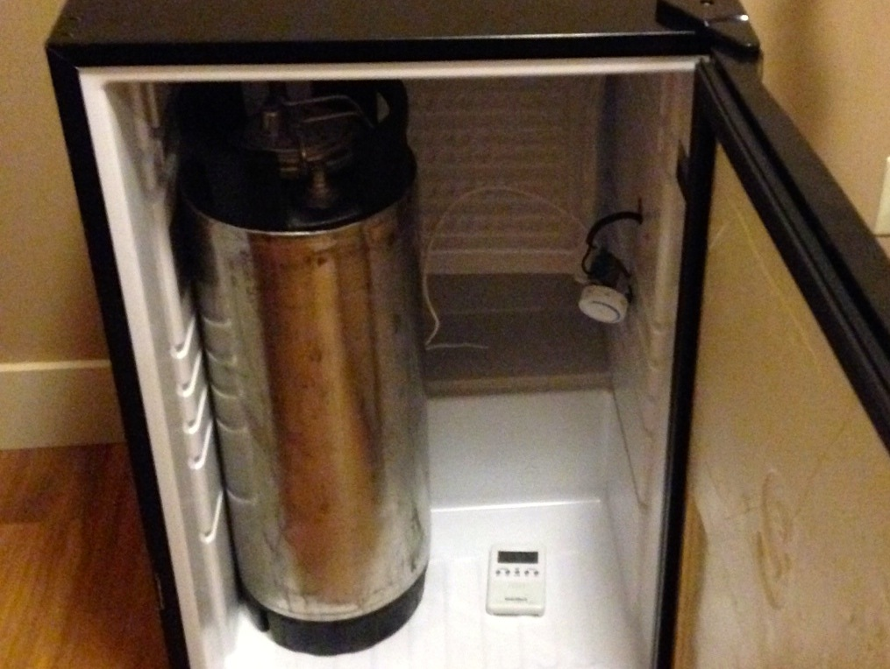

About a year ago I picked up a new hobby - home brewing. I had quite a few friends who were into the hobby before me, and it just so happened that there was pretty great home-brew supply shop in town. So I thought at the time it would be fun to try my hand at brewing my own beer at home.

I quite enjoy the entire brewing process to be honest. For me a picture-perfect Sunday usually involves a few movies on Netflix, a roast chicken in the oven for a late dinner, and brewing an occasional beer over the course of the day. That said my two least favourite aspects of the beer making process involve using my wort chiller (which is a pain in the ass in a small apartment) and the entire bottling process. For now I don't have any other options besides using a wort chiller at home, but I decided to upgrade from bottling to kegging to remove the hassle associated with washing, sanitizing and filling bottles.

The first equipment most people will need before venturing into the realm of kegging is a [corny keg](http://amzn.to/1eh3fgj) to hold the beer, a [pressure regulator](http://amzn.to/JpES1O), a [CO2 tank](http://amzn.to/JwSjOe) and a few hoses. I purchased all three together at my local beer supply shop for around $200, but your mileage may vary depending on what's available locally.

If you already have a fridge that can accommodate the keg then you might be happy with just that and a [cobra tap](http://amzn.to/1dgMOeZ). But my goal was always to have a dedicated fridge and dispensing mechanism for the beer.

### What Type Of Mini-Fridge To Use

Some people manage to find great deals online for a used fridge on places such as Craigslist. My main issue with buying a fridge used was that I didn't really want to buy a beat-up one, and that's usually what people are offloading there. Since the kegerator was likely to end up somewhere in my living room, I decided to purchase one new so that it wouldn't be too much of an eyesore in my apartment.

In both cases you will likely need a fridge that's at least around 4.5 cubic feet inside. Ideally that fridge won't have a freezer compartment, but many people (myself included) have converted those that have a freezer compartment as well. It really comes down to what's available in your area.

I went down to Future Shop here in Chilliwack and took a look at which mini-fridges they had available. If you can bring a corny keg with you into the store that's ideal, because then you can hold it up to most fridges and see what it would look like. If you can't do that or don't want to bring a keg into the store, then grab a measuring tape and take a few measurements of the keg at home to compare against in the store.

Once you are sure the corny keg will fit inside (or that two kegs will fit inside if you're making a dual tap kegerator), then next thing to check is how the shelving on the door is attached. You'll likely have to remove the shelves on the door, and how they are fastened will affect how much work it will take to convert the fridge. Luckily for me a quick investigation of a GE 4.5 cubic foot fridge showed that the shelving unit in the door was in fact secured with screws that were hidden by the magnetic strip on the door.

Unfortunately this unit also contained a freezer compartment, which is problematic. To fit corny kegs into a fridge with a freezer compartment generally involves folding the bottom of the freezer against the back wall of the fridge. The trick with this is that the freon lines for the fridge run through this component and any fractures or kinks in the line will turn the fridge into a useless paper weight.

\[caption id="attachment\_12206" align="aligncenter" width="960"\] Mini-Fridge For My Kegerator Project\[/caption\]

Despite the risk associated with converting a mini-fridge with a freezer compartment, I ended up deciding on a [GE 4.5 cubic foot fridge](http://www.futureshop.ca/en-CA/product/general-electric-ge-4-5-cu-ft-bar-fridge-gmr05blpbsc-gmr05blpbsc/10182177.aspx) from Future Shop here in Chilliwack, Canada for $199 CAD.

Here are the steps to convert my new mini-fridge into a kegerator for chilling and serving home brew. If you're going to use these steps as a basis for your project, then do so knowing it's at your own risk - it's possible to completely kill a fridge by doing this, although with some patience and research most people do just fine. Never work on your fridge while it is plugged into the wall - all my examples below were performed with the unit unplugged from the wall.

### Step 1: Removing The Interior Shelves

In my fridge the shelves and crisper drawer were thankfully all ones that could be removed just by pulling them out. If yours are the same, then just pull them out and try to find a use for them somewhere else in your house. Worse case you can simply toss them out, but I always try to find a home for anything that doesn't need to end up in a landfill if possible.

If your shelves are screwed or glued in, then you'll need to deal with that. But once all the shelves are out you can then turn your attention to the door shelves.

**Time Required: 5 minutes**

### Step 2: Removing The Door Shelves

In almost all cases the shelves on the door of a mini-fridge will prevent the fridge door from being closed once a corny keg is placed inside. That means they gotta go.

I've seen several other tutorials online where the shelving units were glued to the door. If you find yourself in that situation, you'll likely have to use some kind of saw to remove them. Ideally the shelving unit will be fastened with screws though just like mine. In this case, simply remove each screw one at a time until the door comes loose.

\[caption id="attachment\_12212" align="aligncenter" width="1024"\] The Mini-Fridge Shelves From The Door After Removal\[/caption\]

\[caption id="attachment\_12217" align="aligncenter" width="1024"\] Fridge With Door Shelves Removed\[/caption\]

**Time Required: 15 minutes**

### Step 3: Building A New Inside Panel For The Fridge Door

At this point I figured I could just reattach the magnetic strip without the shelving unit and the door work close just fine. It sort of works, but there are two problems with this. The first is that the insulation on the inside of the door is now exposed. That might be fine, but others seem to think that it will eventually get wet and that may possibly lead to the growth of mold. The other reason is that the screws are meant to go through approximately 3/8" of shelving unit, and without them they don't fit as well as they used to. So you should probably replace the shelving unit with something else that's approximately the same size.

I eventually picked up a piece of 24" x 48" corrugated plastic from Home Depot for about $10 to use as the interior for my door. I used the old door as a template and simply traced around it on the plastic. Then with a pair of scissors I cut along the lines I traced to reveal appropriated sized plastic for the door.

\[caption id="attachment\_12215" align="aligncenter" width="1024"\] Building A New Door For The Kegerator\[/caption\]

You'll also want to trace out where the holes are so that you can drill pilot holes through them for your screws to go back into. Be extra careful while drilling since having any of these holes slightly misaligned will complicate things when trying to attach your new panel to the door after.

Once you have your new panel constructed, you can simply reattach both it and the magnetic strip to the door using the screws you removed previously.

\[caption id="attachment\_12222" align="aligncenter" width="1024"\] The Completed Kegerator Door\[/caption\]

**Time Required: 30 minutes**

### Step 4: Relocating The Thermostat

The thermostat (the thing you turn to change the temperature of your mini-fridge) on most fridges will most likely need to be moved to accommodate one or both of your corny kegs. Mine was held in place by only one screw. Once I removed that the plastic covering came off simply by pulling it towards the front of the fridge which dislodged a few plastic feet that were holding the far side of the covering in place.

\[caption id="attachment\_12232" align="aligncenter" width="870"\] The Fridge Thermostat\[/caption\]

Almost all thermostats have 4-wires: one for grounding, one to the compressor, one to power, and one to measure the internal temperature. The internal temperature wire is usually secured at the back of the fridge near the cold plate. You can experiment with moving this to a different location if you need, but in my experience it worked best to leave it where it was originally.

You'll likely need to extend the power, compressor and ground wires if you want to move the thermostat to the back of the fridge. You'll have to check what the amperage is of your fridge to determine what size wired you use. As always, you should make electrical splices according to local electrical code, which usually means they need to be in an electrical box.

**Time Required: 30 minutes**

### Step 5: Bending The Cold Plate

Now we're at the scary part. Up until now nothing we've really done to the fridge contained any risk of rendering it useless. But bending the cold plate can result in the rupture of a freon line which will damage the fridge, likely beyond repair. If that happens you will likely be tossing your entire fridge in the garbage, so be careful with this step. You can see the little grooves on the cold plate in this next image - the freon runs inside of those.

\[caption id="attachment\_12224" align="aligncenter" width="1024"\] A Close-up Of The Cold Plate\[/caption\]

If your cold plate is attached to the fridge interior using screws, then go ahead and remove them. Unfortunately for me the cold plate on my fridge was basically wedged into a groove. I ended up simply bending the cold plate away from the left and right sides of the fridge and away from each groove, but this was \*extremely\* difficult and time consuming. If I were to do it again I would probably try to find some kind of power tool to cut the metal along both sides.

In terms of actually bending the cold plate down towards the back wall, just be careful. I didn't really take any precautions to make sure I wouldn't kink a line, but I did go slowly and kept close attention on the main entry point for the freon at the back of the fridge. Like others, I didn't fold the cold plate completely against the back wall, but essentially angled it downwards so that it would be out of the way of the corny kegs. If you are planning on putting a 5 or 10 lb carbon-dioxide canister inside the fridge then you will likely have to bend it all the way back.

\[caption id="attachment\_12239" align="aligncenter" width="1015"\] The Bent Cold-Plate Inside My Partially Completed Kegerator\[/caption\]

Once you've finished this step you may want to plug the fridge in for a few minutes and confirm that it still works. Mine made a few small gurgling sounds at this point, I assume because the configuration of the cold plate had changed. But that went away after about 20 seconds and now it purrs normally again.

**Time Required: 60 minutes, but it felt like forever**

### Step 6: Installing The Beer Tower

At this point I was ready to cut the hole for my beer tower. I shopped around previously for the beer tower I wanted, and eventually settled on a [chrome plated dual tap beer toward with Perlick faucets](http://amzn.to/1bSpVjD). The Perlick faucets add an extra $50 or so to the price, but most reviews I read said they are the best ones to get as they don't leak or gunk up after pouring. They also look pretty awesome.

You're eventually going to probably need to drill five holes into the top of your mini-fridge: four for the tower screws/bolts, and one large one for the lines. Some of the other tutorials online used a 2.5" hole saw, but it seemed excessive to me so I opted for a 2 and 1/4" one. I had to [purchase a the hole saw and an arbor](http://amzn.to/JpUQt1) just for this project, but you might have a friend you can borrow these off of.

You may encounter piping in the top of the fridge when you start drilling. If you puncture any of these pipes your fridge is toast, so you need to be careful. Some people spread a mixture of cornstarch and water over the top of their fridge and then turn it on for a while to see where the coils are (the water will dissipate from the top of the fridge differently depending on where the coils are). I decided to just drill very carefully and stop whenever I felt any resistance.

There are likely three layers you will traverse - the top (which is made of metal) the interior insulation, and then the plastic interior of the fridge. The top is the hardest, while the other two are relatively easy to drill through. So be prepared to stop your drill as soon as you break through the top metal. Once I removed the metal using the hole saw, I carefully used a screwdriver to remove the insulation bit by bit to make sure there wasn't any wiring or piping inside. Thankfully in my case there wasn't any.

The screws that came with my beer tower were about 1" long, and definitely weren't long enough to go all the way through the top metal, insulation, and the plastic interior of the fridge. It also didn't come with any locking nuts, which to me is the best way to secure the beer tower and make it so that it won't move (especially if someone bumps it while attempting to pour a beer). So I picked up some new 2.25" long 10-32 machine screws from Home Depot along with 10-32 nuts for them. While there I picked up some [piping insulation](http://amzn.to/1fgaDoK) to use to help insulation the inside of the beer tower.

\[caption id="attachment\_12242" align="aligncenter" width="1024"\] New Screws For The Beer Tower\[/caption\]

A lot of people who stop there seem to indicate that they end up with foamy beer when they first start to pour beer each day. The reasoning behind it is that while the beer in the corny kegs stays cool thanks to the fridge, the beer in the lines near the beer taps is quite a bit warmer. As beer warms up, it loses its ability to keep carbon dioxide dissolved in it, which is why it foams when it comes out and also why it goes flat.

\[caption id="attachment\_12244" align="aligncenter" width="1024"\] Partially Installed Beer Tower With Pipe Insulation\[/caption\]

Some people use a PC computer fan to blow air up into the tower in an attempt to keep the beer lines cool. That sounds like it would work to me, but would require me drilling even more holes in the fridge to be able to supply additional power for the fan. Instead I opted to try something simpler first: wrapping copper tubing around each of the beer lines. The theory behind this is that the copper will essentially act as a heat sink for the warm beer in the lines, helping to keep it cool. As long as some of the copper extends into the fridge, the compressor should be able to draw heat out of the tower when it runs. For this I picked up some 0.5" copper tubing from Home Depot.

\[caption id="attachment\_12248" align="aligncenter" width="1024"\] Copper Tubing Inside The Beer Tower\[/caption\]

I basically installed the tower and then slid the copper tubing over each of my beer lines. Thanks to the pipe insulation, the copper fit very snugly into the tower so any type of fastening was unnecessary.

**Time Required: 30 minutes**

## The Completed Kegerator

From start to finish this project entailed about three hours of work spread out over three or four days. I had to make a few runs to Home Depot to pick up parts at various stages, but it was a really enjoyable process.

The corny keg, carbon dioxide tank, hoses and gas filling probably cost me $200 or so, which is the equipment needed to start kegging and dispensing home brew. The Kegerator itself, which includes the fridge, beer tower and other miscellaneous parts cost around $400.

\[caption id="attachment\_12255" align="aligncenter" width="1024"\] My Completed Kegerator\[/caption\]

I'm anxiously awaiting next week when I'll be able to pour my first home brew from my kegerator, hopefully just in time for Christmas dinner. I also have a drip-tray ordered as well, which I'll install as soon as it arrives. But all in all it's been a great project, and I highly recommend anyone who is looking to get into kegging to possibly put together their own kegerator. If you end up building one, please drop a line and share how it went with me and everyone else.
