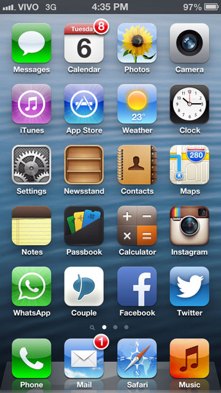

One of the downsides to always having the latest and greatest iPhone is that most places outside of North America and Europe seriously lag behind in terms of adoption rates. For places like Brazil and Argentina, that's even more true because the cost of picking up a new iPhone is nearly twice as much as we would pay in North America.

When I went to Argentina in 2012, I couldn't find a Micro SIM card anywhere, and was forced to buy a normal full-sized SIM card and perform surgery on it to make it fit into a Micro SIM holder. I had to do that twice while travelling around the world with my iPhone 4/4S, and thankfully it worked both times.

Not that long ago I picked up an iPhone 5 which uses an even smaller SIM card known as the Nano SIM. I was told that in theory it was possible to convert a normal SIM card into a Nano SIM card, but that it was difficult. I asked around and none of my friends had tried it before. Since then I've performed this particular surgery three separate times on SIM cards from three different carriers, and it's work flawlessly each time. But given that the last representative I talked to in Peru didn't even know that such a thing was possible (in fact he wanted to see me perform the surgery inside the Vivo office in Cuzco, Peru, so he could learn), I thought I would do a post detailing how to cut a SIM into a Nano SIM (if you want to cut a Micro SIM into a Nano SIM, continue reading - it's basically the same procedure). You can also use this guide to [cut a SIM into a Micro SIM](/tips/how-to-cut-a-sim-into-a-nano-sim/) as well - just follow the same instructions.

### What You Will Need

Here is a list of what you should have at your disposal prior to starting:

\[caption id="attachment\_10879" align="aligncenter" width="1024"\] Tools Needed to Cut a SIM Into a Nano SIM Card\[/caption\]

- 1 Nano SIM compatible device such as the iPhone 5
- 1 SIM card, usually purchased from a local vendor in a different country
- 1 working Nano SIM card, presumably the one that came with your phone
- 1 set of grooming scissors (i.e. they must be small)
- One chilled victory beer for when this is all over

While not shown in the image, you'll also need some way to pop your Nano SIM card out of the device. The iPhone 5 comes with a SIM puller so you can use that. If you don't have access to one, simply find a paper clip or a needle and use that to pop the tray out.

And just a little disclaimer before starting: it's possible to damage your working SIM card or your phone with this procedure. If you're going to try this, I'm obviously not responsible for anything that might go wrong.

### The Goal

The end-goal of this procedure is to basically trim the SIM card into the same shape as the Nano SIM card. But first, we need to examine both to get an idea of how they work.

One corner of both the SIM and the Nano SIM cards is chamfered (i.e. cut on a diagonal). This feature is used to orient the device properly in the phone. In our case, it's also used to make sure we are aligning the cards properly when we finally start cutting.

\[caption id="attachment\_10883" align="aligncenter" width="1024"\] Comparing a SIM and a Nano SIM Card\[/caption\]

Make no mistake - the Nano SIM card is quite small, and basically is the same size as the chip area on the normal SIM card. But have no fear, you'll do fine.

### The Procedure

Ok, since you're ready to go, we might as well start cutting.

1. Orient the SIM and the Nano SIM such that the chips are both facing you and the chamfered (i.e. the diagonal) corner is in the same position on both
2. Place the Nano SIM on top of the SIM card so that the chips are overlapped as precisely as possible. Often the chips will be slightly different sizes and have slightly different markings, so don't be too concerned if they don't exactly match. But often you can find some lines that are in the same position on both, in which case you should orient those exactly.
    
    \[caption id="attachment\_10886" align="aligncenter" width="1024"\] Orienting The Nano SIM On The SIM Card\[/caption\]
    
    As you can see in this photo, the working Nano SIM card is placed on top of the SIM card, the chamfered corners are in the same orientation, and the horizontal black markings on both chips are in the same position. Whatever distance is left is split between all the sides so the Nano SIM is basically centred on the SIM chip.
3. Using your scissors, carefully cut all around the Nano SIM card, making sure not to damage or cut the Nano SIM, but instead using it to basically trace the same shape onto the SIM card below using the scissors. If you feel more comfortable making a rough cut first and then cleaning it up, then feel free to do that. Personally I try to get as close as possible with my first cuts.
    
    If your scissors are slightly curved, this procedure is still possible but will likely be a bit trickier to get straight edges
4. Once you are done cutting, you should visibly examine your new Nano SIM card and make sure the edges are as straight as possible.
    
    \[caption id="attachment\_10890" align="aligncenter" width="1024"\] Comparing our new Nano SIM to the old Nano SIM\[/caption\]
    
    You will never be able to get the new Nano SIM to be as precise as the old Nano SIM, and that's fine - you'll see that it's still possible to insert the card into the tray even if it's not entirely exact.
5. Now place the new Nano SIM into the device tray to make sure it fits. Often at this stage I'll find an edge that needs to be cut a little further before it fits, so I'll clean the new Nano SIM up a bit more here.
    
    \[caption id="attachment\_10893" align="aligncenter" width="1024"\] Move over Michaelangelo: My perfectly formed Nano SIM in the iPhone 5 Tray\[/caption\]
    
    But usually the Nano SIM fits quite easily into tray, as shown in the photo above.

### Moment of Truth: Inserting the SIM and Activating Your New Number

Before you take the last step, make absolutely certain that the Nano SIM fits nicely into the tray.

\[caption id="attachment\_10898" align="alignright" width="300"\] My iPhone 5, Now on the VIVO Network in Brazil\[/caption\]

I did a poor job cutting a SIM into a Micro SIM for my iPhone 4S once, and that sucker was stuck in the phone for almost an hour as I tried to massage the tray out of the phone after I inserted it. The Nano SIM card should fit in the tray easily, but not have so much extra wiggle room that it runs the risk of falling out. Wiggle the Nano SIM around in each direction to be sure of that. I'll usually slide the tray in and out a few times at this stage to make sure that it's smooth and nothing catches (but also making sure not to fully insert it at this stage until I'm sure it's a nice fit).

Once you're confident that everything feels fine, feel free to plunge the SIM card into the phone. At this point you can pour yourself a nice cool beer or a glass of wine while waiting for the phone to find the new carrier.

While sometimes you will wait a few minutes before the phone successfully finds the new network, often this process is complete within 30 seconds or so. Once that happens, you can be sure your new Nano SIM card is working, and continue on with activating your cellular plan, or using it if it's already properly setup.

I've cut SIM cards into Micro SIM cards twice now, and SIM cards into Nano SIM cards three separate times. In all of these cases I've ended up with a working device, so don't be afraid to tackle this procedure yourself. Just be careful while cutting and make extra sure that the new Micro SIM or Nano SIM card slides into your device without any resistance.

### Troubleshooting

Assuming you've done this procedure properly, you hopefully shouldn't have any issues. But if you do, here are a few things to check.

First, you need to have an unlocked device to make this possible. If you are uncertain whether or not your device is locked, it's something you should consider if your new Nano SIM card fails to find the cellular network, especially if you try this more than once.

Second, if the pin configuration on the SIM card vs the Nano SIM card is different, take note that the pins on the right (the same side as the chamfered corner) are typically not connected to anything. That means that if you need to sacrifice a significant portion of the copper chip area on the SIM card, then you should do so by cutting from the right side, not the left. This is not normal though, and in most cases you'll leave the SIM chip intact on the left and right sides.

### Celebratory Drink

Well, you've just finishing cutting a SIM into a Nano SIM: congratulations. Close the computer down and celebrate with that victory drink you just poured yourself. And by all means please drop a comment and let me know of your new success and the new travel skill you just acquired.

If you do lots of travelling and have time, you can also [buy a Micro/Nano SIM card cutter](http://amzn.to/11Knvz0) - these devices can be used to quickly cut a SIM into a Micro or Nano SIM.

### More Information

If you're looking for travel tips like these, grab my free travel eBook, [Guide to Long-Term Travel and Lifestyle Design](http://www.migratorynerd.com/guide-to-long-term-travel-and-lifestyle-design/) - it also contains great tips for how to travel for free (something I've used to my advantage as I've visited 31 countries over the last three years). You can also read one of my more popular posts on this website, [How To Fly For Free](http://www.migratorynerd.com/tips/mileage/how-to-fly-for-free/) (which I've used to earn many free round-trip flights around the world).
